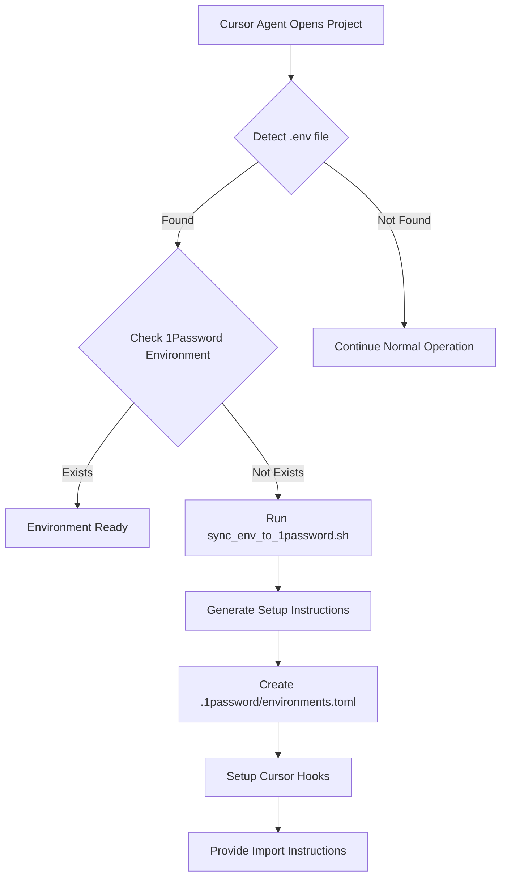

# Cursor Agent Integration for 1Password Environments

This document explains how to integrate automatic .env file detection and 1Password Environment creation with the Cursor Agent.

## Overview

When working in a project that has an existing `.env` file, the Cursor Agent can automatically:
1. Detect the `.env` file
2. Check if a corresponding 1Password Environment exists
3. Generate setup instructions if the environment doesn't exist
4. Help import the credentials into 1Password

## How It Works

### Detection Flow



### Agent Workflow

1. **Detect `.env` file** in project root
2. **Extract project name** from directory or git remote
3. **Check if 1Password Environment exists** (by checking for mounted FIFO file)
4. **If missing:**
   - Run `create_project_environment.sh` with detected project name
   - Generate `.1password/environments.toml`
   - Set up Cursor hooks
   - Provide step-by-step instructions
5. **If exists:**
   - Verify the environment is properly configured
   - Optionally sync changes from `.env` to 1Password

## Usage from Cursor Agent

### Automatic Detection

The Cursor Agent can automatically detect and handle `.env` files when:

1. **Project is opened** - Agent checks for `.env` files
2. **`.env` file is created** - Agent detects new files
3. **User requests environment setup** - Agent can run the sync script

### Manual Trigger

You can also manually trigger the sync from Cursor:

```bash
# From project root
~/dotfiles/config/api-credentials/sync_env_to_1password.sh

# Or specify project path
~/dotfiles/config/api-credentials/sync_env_to_1password.sh /path/to/project
```

## Integration Points

### 1. Project Initialization

When a new project is created or opened:

```bash
# Agent can run this automatically
cd /path/to/project
~/dotfiles/config/api-credentials/sync_env_to_1password.sh
```

### 2. .env File Detection

The agent can detect `.env` files in common locations:

- `.env`
- `.env.local`
- `.env.development`
- `.env.production`

### 3. Environment Check

The agent checks for existing environments by:

- Looking for `.1password/environments.toml` configuration
- Checking if the mounted `.env` file exists as a FIFO (named pipe)
- Querying 1Password database (if sqlite3 is available)

## Cursor Agent Rules

To enable automatic detection, add this to your Cursor rules or agent configuration:

```markdown
When working with a project that has a `.env` file:

1. Check if a 1Password Environment is configured
2. If not configured, run: `~/dotfiles/config/api-credentials/sync_env_to_1password.sh`
3. Follow the generated setup instructions
4. Help the user create the environment in 1Password desktop app
```

## Example Agent Interaction

### Scenario: New Project with .env File

**User:** "I'm working on a project that has a `.env` file. Can you help set up 1Password?"

**Agent:**
1. Detects `.env` file in project root
2. Runs `sync_env_to_1password.sh`
3. Generates setup instructions
4. Provides step-by-step guidance

**Output:**
```
Found .env file: /path/to/project/.env
Project name: myproject
Environment name: myproject

1Password Environment not found. Generating setup instructions...

✓ Created .1password/environments.toml
✓ Created .cursor/hooks.json
✓ Created setup instructions

Next steps:
1. Open 1Password Desktop App
2. Create environment: myproject
3. Configure local .env file path: /path/to/project/.env
4. Enable the environment
```

## Helper Functions

The `env_helpers.sh` file provides these functions:

### `detect_env_file [project_root]`
Finds `.env` files in common locations.

### `get_project_name [project_root]`
Extracts project name from git or directory name.

### `check_1password_env [env_name] [mount_path]`
Checks if 1Password Environment exists and is mounted.

### `parse_env_file [env_file]`
Parses `.env` file and formats for 1Password import.

### `sync_env_to_1password [project_root]`
Main sync function that orchestrates the entire process.

## Scripts

### `sync_env_to_1password.sh`
Main entry point for syncing .env files with 1Password. Can be called from Cursor agent or manually.

**Usage:**
```bash
sync_env_to_1password.sh [project_root]
```

### `create_project_environment.sh`
Creates project-level 1Password Environment configuration. Called automatically by sync script.

**Usage:**
```bash
create_project_environment.sh --project-name NAME [options]
```

## Configuration Files Generated

### `.1password/environments.toml`
Specifies which `.env` files to validate:

```toml
mount_paths = [".env"]
```

### `.cursor/hooks.json`
Configures Cursor hooks for validation:

```json
{
  "version": 1,
  "hooks": {
    "beforeShellExecution": [
      {
        "command": ".cursor/hooks/1password/validate-mounted-env-files.sh"
      }
    ]
  }
}
```

### `.1password/SETUP_INSTRUCTIONS.md`
Step-by-step instructions for manual setup in 1Password desktop app.

## Best Practices

1. **Run sync early** - Set up the environment when the project is first created
2. **Keep .env in sync** - Update 1Password when `.env` changes
3. **Use gitignore** - Ensure `.env` files are in `.gitignore`
4. **Document requirements** - Add setup instructions to project README

## Troubleshooting

### Agent Not Detecting .env Files

- Ensure the project root is correctly identified
- Check that `.env` file exists and is readable
- Verify the sync script is executable

### Environment Check Failing

- Ensure 1Password desktop app is running
- Check that sqlite3 is installed (for database queries)
- Verify the environment is enabled in 1Password

### Setup Instructions Not Generated

- Check that `create_project_environment.sh` exists and is executable
- Verify write permissions in project directory
- Check script output for error messages

## Future Enhancements

- **Automatic import** - Directly import .env into 1Password via API (when available)
- **Bidirectional sync** - Sync changes from 1Password back to .env
- **Multi-environment support** - Handle multiple environments per project
- **Git integration** - Automatically set up environments for git repositories

## Related Documentation

- `CURSOR_HOOKS_SETUP.md` - Cursor hooks configuration
- `create_project_environment.sh` - Project setup script
- `SETUP_GUIDE.md` - Complete setup guide
- [1Password Environments Documentation](https://developer.1password.com/docs/environments)

