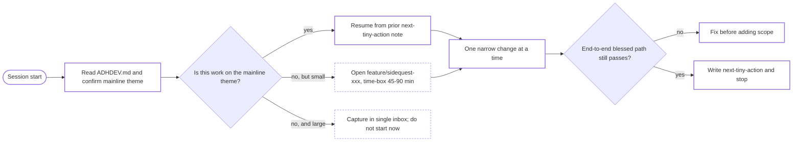

# ADHDEV — engineering partnership for ADHD-aware focus

This is a workflow skill, not medical guidance. It describes how the agent
should structure work and conversations to **protect deep focus**, **reduce
context-switching cost**, and **make the next step obvious** when the user
sits back down — without falling into shame-driven overwork.

It is the engineering-process complement to two installed lifestyle skills:

- `adhd-daily-planner` — day-level structure, transition buffers, 3-Things,
  shutdown ritual.
- `project-management-guru-adhd` — context-switch tax, hyperfocus interrupt
  rules, parakeet reminders, task chunking.

Read those if you are about to do day planning, time blocking, or hyperfocus
intervention. Read this skill when you are about to **act on code**.

## When to invoke

Activate this skill when any of the following are true:

- The workspace contains an `ADHDEV.md` (anywhere, e.g.
  `storyvale-engine/docs/ADHDEV.md`). Read it once at the start of the
  session and treat it as authoritative for that repo's mainline definition.
- The user says any of: "stay focused", "don't drift", "sidequest",
  "time-box", "spike", "next tiny action", "what was I doing", "I have
  ADHD", "I'm distracted", "we're hyperfocused", "let's wrap up".
- You are about to spawn broad exploration, multi-file refactors, or
  parallel branches before one mainline change is finished.
- The session has crossed ~2 hours of continuous work or has produced no
  end-to-end run of the blessed path.

If none of those apply and the task is a single small edit, do not announce
this skill — just use it implicitly.

## Core contract: mainline laser, sidequests parked

Every project under this protocol has exactly one **mainline theme** for the
current focus block (typically a few weeks). The mainline lives on the
default branch (usually `main`). Anything else is a **sidequest** and gets a
branch.



**Hard rules for the agent:**

- Do not silently start a sidequest. If a fix or refactor is not on the
  mainline theme, stop and say so. Offer either: time-boxed sidequest
  branch, capture-and-defer, or explicit user override.
- Do not open multiple new branches in a session. One sidequest at a time.
- Never push to mainline if the most recent end-to-end run is broken.
- Avoid drive-by changes outside the file or module the user named.

## Session rituals

### Start of session

1. Look for `ADHDEV.md` (root or any subdir). If found, read it and quote
   the mainline theme back to the user in one sentence:
   > "Mainline today: {theme from ADHDEV.md}. Continuing from {next tiny action}?"
2. Look for the previous **next-tiny-action note**. Common locations:
   - End of the most recent commit message.
   - A trailing bullet in `ADHDEV.md` or `TODO.md`.
   - Last line of an open scratch file (`.scratch/NEXT.md`, `NOTES.md`).
   - A trailing line in the most recent agent-transcript or chat.
3. If no note exists, ask **one** question to re-establish context:
   > "Before we start, one sentence: what's the next concrete action on
   > the mainline?"
4. Convert that single sentence into the first todo item before any tool
   call that touches code.

### Mid-session

- Keep the working set narrow. If you would have to read more than ~5 files
  outside the current module to make progress, stop and report what you
  need before fanning out.
- Treat tool fan-out as a context switch. Prefer one investigation thread
  to four parallel ones, except when explicitly using the parallel
  exploration agents for *independent* read-only research.
- If the user asks for something that would expand scope, name it as a
  candidate sidequest and ask whether to park it.
- If you find a real bug unrelated to the mainline change, do **not** fix
  it inline. Capture it as a one-liner in the single capture inbox (the
  user's preferred place — repo-local `TODO.md`, an issue, or a note) and
  return to the current change.
- Every ~45-90 minutes of model-time work, surface a checkpoint:
  > "Time check: ~N minutes on this thread. Mainline run last passed at {step}. Continue, switch, or wrap?"

### End of session

Always end with three artifacts, even if the user is wrapping abruptly:

1. **Next tiny action** — one concrete physical step:
   - Open file X, run command Y, or read function Z.
   - It must be doable in under 5 minutes from a cold start.
2. **Mainline status** — does the blessed end-to-end path still run? If
   not, where it broke.
3. **Sidequest log** — if a branch was opened, one line on outcome (kept,
   discarded, parked, merged).

Write these into the place the user designated as their capture inbox. If
unsure, default to a single trailing block at the bottom of `ADHDEV.md` or a
`NEXT.md` file in the repo root — not multiple scattered notes.

## Working-together rules with the agent

These are condensed from patterns that hold up well for ADHD developer + AI
collaboration ([Zack Proser — *Claude as My External Brain*](https://zackproser.com/blog/claude-external-brain-adhd-autistic);
ravila4's `claude-adhd-skills/CLAUDE.md`):

- **Concur through action, not validation.** When an idea is good, build
  on it; when a correction is right, fix it. Skip "great idea!" filler.
- **Stop and ask** rather than assume scope. If the user's intent could be
  satisfied two materially different ways, name them and ask, instead of
  silently picking one.
- **Push back on bad ideas.** Cite a specific reason. If the only reason is
  a gut feeling, say so explicitly.
- **Narrow scope with crisp boundaries.** A 20-line targeted change beats a
  200-line cleanup that also "fixes things."
- **Deterministic validation.** Prefer changes whose success can be checked
  by running a command, not by reading prose.
- **Minimal global coupling.** Avoid touching shared config, env, or build
  unless the user named that as the target.
- **Orchestrate, don't micromanage.** Set narrow acceptance criteria for a
  task and let bounded sub-work return diffs you review, instead of
  watching every keystroke.

## Drift detection

Surface these signals as soon as you notice them, in plain language:

- No end-to-end run of the blessed path for several days but many new files.
- Multiple active branches with no merge criteria or "done means X".
- Architecture churn before one user-visible loop is stable.
- Hours of polish on a non-mainline surface to avoid a harder mainline task.

When a drift signal fires, do not lecture. Offer a small reset:

> "Quick reset: the last green end-to-end run was N. The mainline next-tiny
> -action was M. Want to (a) park current branch and resume M, (b) keep
> going for one more time-box, (c) declare M itself the wrong target?"

## Time-boxing and hyperfocus

For deeper interrupt rules (when to leave hyperfocus alone, when to gently
check in, when to firmly stop), defer to
`project-management-guru-adhd/SKILL.md`. Defaults that are safe for any
session in this skill:

- Sidequest branches: 45-90 minutes, then commit, log outcome, return to
  mainline before closing the session.
- Spikes (exploratory hypothesis-testing): write the hypothesis in one line
  before starting; output is a short note kept-or-thrown-away.
- Long sessions: every ~90 minutes, offer a transition-buffer prompt
  ("save work, water, two-minute walk?") rather than continuing silently.

## Anti-patterns to refuse

- Silent multi-branch work on behalf of the user.
- Long parallel chains of clarifying questions before any concrete step.
  Ask one critical question, then propose a smallest-possible next move.
- Adding "while we're here" cleanup to a focused diff.
- "Just focus better" framing in any form. ADHDEV is operational; treat it
  that way.
- Writing five new TODOs in the same session without closing or
  consolidating any existing ones.

## Repo integration

If a repo has its own `ADHDEV.md` (e.g.
[`storyvale-engine/docs/ADHDEV.md`](../../../projects/storytelling-capsules/storyvale-engine/docs/ADHDEV.md)),
that file's table of mainline vs sidequest branches **wins** over any
defaults in this skill. Read it first, then apply this skill on top.

If a repo has no `ADHDEV.md` and the user wants this protocol, the smallest
adoption is a six-line file at repo root:

```markdown
# ADHDEV

- Mainline (one theme):
- Sidequest branch(es):
- Time-box for sidequests:
- Capture inbox:
- Next tiny action:
- Drift check date:
```

That single file gives this skill the variables it needs without any tooling
install.

## Out of scope

- Medical or diagnostic claims. ADHD is mentioned as a working context, not
  a diagnosis to assign, validate, or treat.
- Replacing established workflow skills (TDD, debugging, planning). Those
  still apply; this skill only governs **pacing, scope, and handoff**
  around them.
- Cross-team accountability or HR-style management — that lives in
  `project-management-guru-adhd` if at all.

## Minimal example: applying this skill in one turn

User: "let's keep working on the gallery refresh."

Agent (good):

> "Mainline check: the most recent ADHDEV.md says today's theme is
> 'I2V reliability + one great demo'. The gallery refresh isn't on that
> theme. Options: (a) park gallery on `feature/creative-surface` for a 60
> -minute time-box; (b) capture as a one-liner in NEXT.md and stay on the
> demo; (c) override and switch the mainline theme. Which?"

Agent (bad):

> "Sure, I'll start refactoring the gallery and the catalog and the
> Pretext template at once."

The first response respects the protocol. The second is exactly the drift
this skill is here to prevent.
