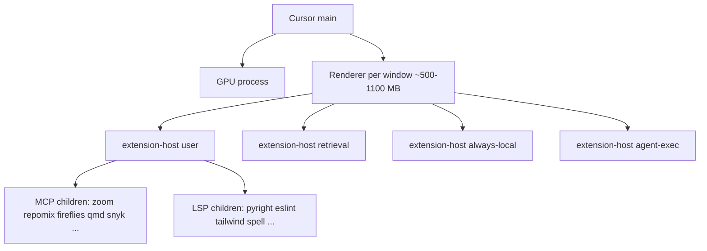
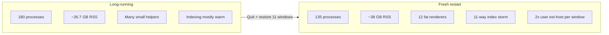

# Cursor extensions and MCP audit
_Exported on 5/29/2026 at 10:25:54 PDT from Cursor (3.6.21)_

---

**User**

let's do a complete cursor extensions and mcp audit and help me understand the impact of what I have enabled along with a current snapshot of all the running cursor processes and memory usage on my system

---

**Cursor**

Gathering Cursor extensions, MCP configuration, and live process/memory data for a full audit.


Here is an audit based on live process data (now), your global `~/.cursor/mcp.json`, `cursor --list-extensions`, this morning’s `cursor --status` snapshot, and the MCP tool descriptors for this workspace.

---

## Executive summary

You are running a **large, multi-window Cursor fleet**: ~**180 processes** and about **~26.7 GB RSS** attributed to Cursor right now. That is driven less by “105 extensions installed” alone and more by:

1. **Many simultaneous workspace windows** (roughly 10–12), each with its own renderer and **four** extension-host roles (`user`, `retrieval`, `always-local`, `agent-exec`).
2. **Global MCP servers duplicated per window** — the same stdio/remote MCP stack is spawned many times (e.g. **10× zoom**, **10× repomix**, **18× fireflies `mcp-remote`**, **9× qmd**, **24× snyk**).
3. **Plugin MCPs** on some workspaces (Snyk, AWS IaC/pricing, Prisma, BrowserStack, chrome-devtools-mcp) adding more children.
4. **Heavy language servers** started per active window (Tailwind ×7, Pyright ×7, ESLint ×11, spell-checker ×11 even though `cSpell.enabled` is `false` globally).

**Biggest lever:** close windows you are not actively using, and turn off MCP servers you do not need for that project.

---

## Live process snapshot (May 29, 2026 ~09:16)

| Metric | Value |
|--------|--------|
| Cursor version (from morning snapshot) | **3.6.14** |
| Machine | M3 Max, **96 GB** RAM (snapshot showed **~3.5 GB free**, load **9–14**) |
| Cursor-related processes | **180** |
| Sum of RSS (all processes matching “cursor”) | **~26.7 GB** |
| Main app | ~514 MB |
| Largest single process | Renderer for **dotfiles/cursor** window ~**1.1 GB** |
| Heaviest extension host | **continuous-ai** user host ~**695 MB**; **cursor** user host ~**911 MB** |

**Process shape (typical per window):**



---

## Open windows (from snapshot + running extension hosts)

Morning `cursor --status` listed **8** named windows; live hosts also show **cursor**, **nick-sublime**, **novel-scenification**, **thebaloney-meta**, etc.

| Window / workspace | Example active file | Notes |
|--------------------|---------------------|--------|
| baloney (Workspace) | YARNIVERSE.md | Multi-root; large `thebaloney-web` tree |
| peeq-carb | engagement admin docs | Very large folder (~4k+ files in snapshot) |
| writing-quality | tab-export markdown | |
| ai-veracity-chains | PlatformOverview.md | |
| continuous-ai | TTS-LANDSCAPE | Heaviest extension host in top RSS |
| storytelling-capsules | plan markdown | |
| switchdimension-community | tab-export | Extra plugin MCPs in past snapshots |
| chatstory | DEV.md | |
| **cursor** (dotfiles) | COMPENDIUM.md | This audit workspace |
| nick-sublime / novel-scenification | (fiction repos) | Extra windows since snapshot |

Each window ≈ **one renderer + 4 extension hosts + file watcher + duplicated MCP stack**.

---

## Extensions: 105 installed (all enabled globally)

There is **no** global “disabled extensions” list in your User `settings.json` — everything in `cursor --list-extensions` loads in **every** window (subject to language activation).

### High-impact groups

| Category | Extensions | Impact |
|----------|------------|--------|
| **Language servers (RAM + CPU)** | `ms-python.python`, `anysphere.cursorpyright`, `redhat.java` + Java pack, `golang.go`, `prisma.prisma`, `hashicorp.terraform`, `vue.volar`, `svelte.svelte-vscode`, `dbaeumer.vscode-eslint`, `bradlc.vscode-tailwindcss` | **Per-window** servers; Pyright can use **32 GB heap** (`--max-old-space-size=32768`) |
| **Multiple AI coding assistants** | `anthropic.claude-code`, `openai.chatgpt`, `saoudrizwan.claude-dev`, `rooveterinaryinc.roo-cline` | Overlap with Cursor Agent; extra panels/processes |
| **Google cloud AI** | `google.geminicodeassist`, `googlecloudtools.cloudcode` | Background services, indexing |
| **Git / worktrees** | `gitworktrees`, `jackiotyu.git-worktree-manager`, `kahole.magit`, `letmaik.git-tree-compare` | Useful but adds watchers/commands |
| **Data / SQL** | `mtxr.sqltools` + drivers, `alexcvzz.vscode-sqlite`, `qwtel.sqlite-viewer` | Extra language servers when those file types open |
| **Containers / K8s** | `ms-azuretools.vscode-docker`, `ms-kubernetes-tools`, `docker.docker` | Heavy when Docker contexts active |
| **Spell check** | `streetsidesoftware.code-spell-checker` | **11 processes running** though `"cSpell.enabled": false` — extension still spawns servers |
| **Session / rules** | `specstory.specstory-vscode`, `beilunyang.cursor-rules` | Sync/history overhead |
| **Keybinding / UX** | `vspacecode.*`, `tuttieee.emacs-mcx`, `vscodevim.vim` | Low RAM; interaction complexity |

### Running extension child processes (sample counts now)

| Server | Instances |
|--------|-----------|
| code-spell-checker | **11** |
| eslint | **11** |
| tailwindcss | **7** |
| cursorpyright | **7** |

---

## MCP audit

### A. Global user MCP (`~/.cursor/mcp.json`) — 7 servers

| Server | Transport | Role | Spawn cost |
|--------|-----------|------|------------|
| **granola** | HTTPS `mcp.granola.ai` | Meeting notes / query | Remote; no local Node |
| **zoom** | stdio Node (`zoom-mcp-server`) | Large Zoom API surface (~60+ tools) | **~10 local processes** now |
| **repomix** | stdio `repomix --mcp` | Pack/grep codebase for agents | **~10** |
| **heypresto** | HTTPS | Needs auth (`mcp_auth` tool present) | Remote |
| **fireflies** | `npx mcp-remote` → Fireflies API | **20 tools** (transcripts, analytics, sharing, …) | **~18** Node/npx processes |
| **product-hunt** | Python `product-hunt-mcp` | **11 tools** | **~10** |
| **qmd** | Node `qmd mcp` | Local search over **1625** docs (2 collections) | **~9**; QMD index RAM depends on corpus |

**Agent context impact:** For this workspace alone, descriptors under `~/.cursor/projects/Users-me-dotfiles-cursor/mcps/` expose on the order of **~120+ tools** (Zoom + Fireflies dominate). Large tool lists increase prompt/schema overhead and mistaken tool choice even when idle.

### B. Cursor plugins (marketplace cache under `~/.cursor/plugins/cache/cursor-public/`)

Installed plugin packages include: **cloudflare**, **vercel**, **context7**, **compound-engineering**, **superpowers**, **parallel**, **snyk-secure-development**, **figma**, **stripe**, **supabase**, **prisma**, **neon-postgres**, **linear**, **notion-workspace**, **slack**, **browserstack**, **clerk**, **deploy-on-aws**, **database-skills**, **continual-learning**, **cursor-team-kit**, etc.

**Active in this session (from MCP folder):**

| MCP | Tools (approx) | Notes |
|-----|----------------|-------|
| cursor-ide-browser | ~15 | Browser automation |
| plugin-context7 | 2 | Docs lookup |
| plugin-cloudflare-docs | 2 | Docs search |
| plugin-cloudflare-builds/bindings/observability | auth gates | Need login |
| plugin-vercel | auth gate | Need login |

### C. Per-workspace plugin MCP (from `cursor --status` / processes)

On **switchdimension-community** (and similar) snapshots also spawned:

- **Snyk MCP** — `npm exec snyk@latest mcp` (**24** related processes now)
- **AWS IaC + pricing** — `uvx awslabs.*`
- **Prisma MCP**, **BrowserStack MCP**, **chrome-devtools-mcp**

These are **not** in global `mcp.json`; they come from **enabled Cursor plugins per project**.

### D. MCP duplication map (root cause of bloat)

| MCP component | Process count (now) | Why |
|---------------|---------------------|-----|
| snyk | **24** | Plugin enabled on many workspaces × extension hosts |
| fireflies `mcp-remote` | **18** | Global server × windows/hosts |
| zoom | **10** | Global × windows |
| repomix | **10** | Global × windows |
| product-hunt | **10** | Global × windows |
| qmd | **9** | Global × windows |

So global MCP is effectively **7 logical servers × ~10 windows ≈ 70+ MCP-related processes**, before Snyk/AWS/Prisma extras.

---

## Settings that affect behavior

From `~/Library/Application Support/Cursor/User/settings.json`:

- **`cSpell.enabled": false`** — but spell-checker extension still runs (**11 servers**); disable the extension or use `"extensions.ignoreRecommendations"` / workspace disable.
- **`workbench.editorAssociations": { "*.md": "markdown.preview.editor" }`** — previews by default (extra webview work).
- **`specstory.cloudSync.enabled": "always"`** — continuous sync I/O.
- **`update.releaseTrack": "dev"`** — dev channel.
- **Security:** `codegenPreflight.*ApiKey` entries store **plaintext API keys** in settings. Prefer env vars / 1Password (your `op-credentials` skill pattern). Rotate keys if this file is ever synced or shared.

Your dotfiles doc [`docs/IGNORING.md`](docs/IGNORING.md) already notes: MCP and terminal are **not** fully limited by `.cursorignore` — separate from extension/MCP process cost.

---

## Impact model (what costs what)

| Layer | Idle cost | Active agent cost |
|-------|-----------|-------------------|
| Extra **window** | +~2–4 GB (renderer + 4 hosts + MCP copies) | High CPU on index/LSP |
| **Global MCP** (7) | Multiplied per window | Large tool schema in every chat |
| **Snyk / AWS / Prisma** plugins | Extra stdio children per enabled workspace | Security scans, network |
| **Java / Python / Tailwind / ESLint** | Per-window LSP RAM | Spikes on save/open |
| **105 extensions** | Activation on file type | Many contribute only when relevant |

---

## Prioritized recommendations

### Tier 1 — largest memory wins

1. **Close workspace windows** you are not using today (target **≤3–4** for heavy work). This collapses renderers, extension hosts, and **entire MCP duplicate sets**.
2. In **Cursor Settings → MCP**, disable global servers per project when not needed (e.g. turn off **Fireflies + Product Hunt + Zoom** on dotfiles-only work; keep **qmd** only when searching sovereign-ai/knowledge).
3. **Disable Snyk plugin MCP** globally or on all but 1–2 repos — **24 processes** is outsized for routine editing.

### Tier 2 — extension hygiene

4. **Uninstall or disable** redundant AI extensions (pick one of Claude Code / Cline / Claude Dev / ChatGPT extension).
5. **Disable `redhat.java` pack** unless you are in Java that week (Java LSP is among the heaviest in VS Code ecosystem).
6. **Disable `streetsidesoftware.code-spell-checker`** entirely (or restrict to markdown-only workspaces) since you disabled cSpell in settings but servers still run.
7. Use **Workspace Extension recommendations** to enable Tailwind/Prisma/Terraform only in repos that need them (`extensions.json` + `"extensions.ignoreRecommendations"` where needed).

### Tier 3 — MCP / agent ergonomics

8. **Shrink tool surface:** Fireflies (20) + Zoom (60+) dominate; consider a thin wrapper MCP or disabling Zoom except in meeting-integration projects.
9. **Hey Presto / Cloudflare / Vercel plugin MCPs:** leave disabled until authenticated and needed — they only add auth noise otherwise.
10. **Repomix + QMD:** powerful but overlapping (codebase pack vs markdown search); use one primary strategy per task type.

### Tier 4 — housekeeping

11. Re-run inventory after changes: `cursor --status` (or your `dump-cursor-windows.sh` / compendium snapshot scripts).
12. Move API keys out of `settings.json`; audit git/dotfiles sync paths.

---

## Quick reference: your global MCP config

```1:38:/Users/me/.cursor/mcp.json
{
  "mcpServers": {
    "granola": { "url": "https://mcp.granola.ai/mcp" },
    "zoom": { "command": "node", "args": [".../zoom-mcp-server/src/index.js"], ... },
    "repomix": { "command": "/opt/homebrew/bin/repomix", "args": ["--mcp"] },
    "heypresto": { "url": "https://www.heypresto.ai/mcp", ... },
    "fireflies": { "command": "npx", "args": ["mcp-remote", "https://api.fireflies.ai/mcp"] },
    "product-hunt": { "command": ".../run-product-hunt-mcp.sh" },
    "qmd": { "command": ".../qmd", "args": ["mcp"] }
  }
}
```

---

I can turn this into a dated markdown report under `cursor/docs/` (e.g. `EXTENSIONS-MCP-AUDIT-2026-05-29.md`) with a repeatable shell script to regenerate process counts — say if you want that saved in the repo. I can also propose a minimal “daily driver” MCP profile (e.g. qmd + granola only) vs a “meetings” profile (granola + fireflies + zoom).

---

**User**

I just quit cursor and then started it up again, so do another complete cursor extensions and mcp audit and help me understand the impact of what I have enabled along with a current snapshot of all the running cursor processes and memory usage on my system
and this time compare what we see from the longer-running cursor versus this new instance in terms of fresh-start memory usage and anything else that you notice

---

**Cursor**

Gathering a fresh post-restart snapshot and comparing it to the earlier long-running session.


Here is a full post-restart audit, with a side-by-side comparison to the **long-running session** from earlier today (~180 processes, **~26.7 GB** Cursor RSS, Cursor **3.6.14**).

**Snapshot time:** ~2 minutes after restart (process age ~01:40), re-checked at ~02:10.

---

## Headline: restart did not lighten the load

| Metric | Long-running (before quit) | Fresh restart (now) | What it means |
|--------|---------------------------|---------------------|---------------|
| **Cursor processes** | 180 | **135** → 132 (+30s) | Fewer PIDs, but each process is larger |
| **Sum of Cursor RSS** | **~26.7 GB** | **~37.9 GB** → **~35.9 GB** | **~9–11 GB higher** after “fresh” start |
| **System RAM free** | ~3.5 GB | **~0.88 GB** | Machine is under severe memory pressure |
| **Load average** | 9–14 | **186 / 96 / 45** | Thundering herd: 11 windows + indexers + MCP all at once |
| **Open windows** | ~8–10 (+ extras) | **11** (session restore) | Same multi-window fleet, not a clean slate |
| **Extensions installed** | 105 | **105** | Unchanged |
| **Global MCP servers** | 7 in `mcp.json` | **7** (same) | Unchanged |

**Takeaway:** Quitting Cursor only helps if you open **fewer** windows afterward. Your session restore reopened **11** large workspaces, so the “fresh” instance paid a **parallel startup tax** (renderers, extension hosts, indexing, MCP spawns) that exceeded what the long-running session had settled to.

---

## Process & memory breakdown (fresh instance)

### Totals

- **132–135** Cursor-related processes  
- **~36–38 GB** summed RSS (macOS resident set; not identical to Activity Monitor “memory” but good for comparison)  
- **Uptime:** ~1–2 minutes per top process  
- **Cursor version:** 3.6.14 (unchanged)

### By role (fresh, categorized)

| Role | Count | RSS (approx) |
|------|-------|----------------|
| **Renderers** (one per window) | **12** | **~9.8 GB** (~815 MB each; several **900–970 MB**) |
| **extension-host (user)** | **22** | **~8.0 GB** |
| **extension-host (retrieval)** | 11 | ~4.4 GB |
| **extension-host (always-local)** | 11 | ~3.9 GB |
| **extension-host (agent-exec)** | 12 | ~3.8 GB |
| **Main Cursor** | 1 | ~778 MB |
| **LSP children** (pyright, eslint, tailwind, spell-checker) | 19 | ~3.4 GB |
| **MCP children** (matched zoom/repomix/fireflies/ph/qmd/snyk) | 34 | **~3.1 GB** |

### MCP process counts: long-running vs fresh

| MCP component | Long-running | Fresh (~2 min) | Fresh (+30s) |
|---------------|-------------|----------------|--------------|
| zoom-mcp | 10 | 5 | 5 |
| repomix | 10 | 5 | 5 |
| fireflies (`mcp-remote`) | 18 | 10 | 10 |
| product-hunt | 10 | 5 | — |
| qmd | 9 | 5 | — |
| snyk | 24 | 12 | 12 |

Fresh counts are **lower** only because not every extension host has finished spawning MCP children yet. With **11 windows** and **~5 host roles per window**, you still trend toward **~10+ copies** of each global stdio MCP — same structural problem as before.

### LSP duplication (fresh)

| Server | Long-running | Fresh |
|--------|-------------|-------|
| code-spell-checker | 11 | 6 (still climbing) |
| eslint | 11 | 5 |
| tailwind | 7 | 3 |
| cursorpyright | 7 | 4 |

Spell-checker still runs despite `"cSpell.enabled": false` in User settings.

---

## Eleven restored windows (same fleet as before)

From `cursor --status`:

| # | Window | Notable folder scale (from status) |
|---|--------|-------------------------------------|
| 1 | baloney (Workspace) | Multi-root; large web tree |
| 2 | peeq-carb | ~4,138 files |
| 3 | writing-quality | **>21,689** files |
| 4 | ai-veracity-chains | **>25,367** files |
| 5 | continuous-ai | **>109,795** files |
| 6 | storytelling-capsules | **>20,987** files |
| 7 | switchdimension-community | **>22,661** files (+ plugin MCPs) |
| 8 | chatstory | 162 files |
| 9 | nick-sublime | **>20,974** files |
| 10 | novel-scenification | **>20,397** files |
| 11 | **cursor** (dotfiles) | 961 files — this chat |

Restart did **not** drop a window; it added **nick-sublime** / **novel-scenification** as first-class windows vs the earlier snapshot.

---

## Extensions (105) — impact unchanged

Still **105 globally enabled** extensions. High-impact groups (same as prior audit):

- **Per-window LSPs:** Python/Pyright (heap up to **32 GB** configured), ESLint, Tailwind, spell-checker, JSON/HTML/CSS built-ins  
- **Heavy optional stacks:** Java pack, Go, Prisma, Terraform, K8s/Docker, Vue/Svelte  
- **Overlapping AI extensions:** Claude Code, ChatGPT, Cline, Claude Dev (on top of Cursor Agent)  
- **Google:** Gemini Code Assist + Cloud Code  
- **Always-on utilities:** SpecStory, Git worktrees/Magit, VSpaceCode, Vim/Emacs keybindings  

**Config note:** Plaintext API keys remain in User `settings.json` under `codegenPreflight.*` — move to env/1Password and rotate if that file is synced anywhere.

---

## MCP audit (unchanged config, same impact model)

### Global (`~/.cursor/mcp.json`) — 7 servers

| Server | Type | Agent/context impact |
|--------|------|----------------------|
| **granola** | Remote HTTPS | Meetings; low local RAM |
| **zoom** | Local Node | **~60+ tools**; duplicated per host |
| **repomix** | Local `repomix --mcp` | Pack/grep large repos; CPU + disk |
| **heypresto** | Remote HTTPS | Auth-gated |
| **fireflies** | `npx mcp-remote` | **20 tools**; npm wrapper per spawn |
| **product-hunt** | Python | 11 tools; duplicated |
| **qmd** | Node | Local index over **1625** docs; meaningful RAM |

### Active MCP servers in **this** workspace (13)

User: granola, zoom, repomix, heypresto, fireflies, product-hunt, qmd  
Plugins: context7, cloudflare (docs/builds/bindings/observability), vercel, cursor-ide-browser  

**Tool-surface cost:** Zoom + Fireflies alone expose a large fraction of ~120+ tool schemas to the agent, even when idle.

### Plugin MCPs (workspace-dependent)

**switchdimension-community** (and similar) still pull **Snyk** (+ AWS IaC/pricing, Prisma, BrowserStack, chrome-devtools-mcp on some setups). Snyk is **12 processes / ~24 before** — high fixed overhead per enabled window.

---

## What’s different: long-running vs fresh (why RSS went *up*)

### 1. Parallel “restore everything” spike

Long-running session had already paid startup costs; memory was spread across more **small** helpers (git workers, idle MCP at ~50 MB, etc.) — **180 processes, 26.7 GB**.

Fresh session: **11 renderers** immediately at **~900 MB each** plus **56 extension-host processes** starting together → **fewer processes, more RSS per process**.

### 2. Duplicate **user** extension host per workspace

Every workspace name appears **twice** in `extension-host (user)` right now, for example:

- `cursor` → **[11-3]** (~803 MB) and **[11-16]** (~308 MB)  
- Same pattern for continuous-ai, peeq-carb, switchdimension-community, etc.

So you have **22 user hosts for 11 windows** (2×). That pattern also showed up in the long-running sample (e.g. cursor `[11-51]` and `[11-52]`). This looks like **Cursor 3.6 multi-host architecture**, not a one-off bug — but it **doubles user-side extension RAM** vs a single host per window.

### 3. Indexing storm on huge trees

**continuous-ai** alone reports **>109k files**. After restart, watchers/indexers for many huge repos run at once — CPU (window [5] was **121% CPU** in status) and RAM spike. Long-running session may have been **past peak index** or more idle.

### 4. System was already starved

Restart under **<1 GB free** and load **186** tends to amplify RSS (compression, cache churn, processes not yielding memory back yet). The earlier audit saw **~3.5 GB free** — healthier baseline.

### 5. MCP not fully respawned yet (misleading “win”)

Zoom/repomix at **5** vs **10** is **incomplete startup**, not configuration improvement. Expect counts to climb toward prior levels as hosts finish connecting.

---

## Visual: memory shape comparison



---

## Recommendations (ordered by leverage)

1. **Session restore discipline:** After restart, close windows you will not use today (target **3–4**). That cuts renderers, extension hosts, and MCP copies roughly linearly.  
2. **Do not expect “quit” to fix RAM** with this window set — fresh start was **worse** today.  
3. **Trim global MCP** in Settings → MCP: e.g. keep **qmd + granola** for dotfiles; disable **zoom + fireflies + product-hunt** unless that window needs meetings/PH.  
4. **Disable Snyk plugin MCP** except on repos where you actively scan.  
5. **Disable** `streetsidesoftware.code-spell-checker` (settings disable is not enough).  
6. **Unload Java / Cloud Code / extra AI extensions** when not in use.  
7. **Watch 10–15 minutes after start:** if RSS drifts down and MCP counts rise toward prior levels, that confirms “fresh” was a spike, not a new steady state.

---

## Quick reference: steady-state vs startup expectation

| If you want… | Do this |
|--------------|---------|
| Lower RAM at launch | Restore **fewer** windows; disable unused MCP before opening projects |
| Lower RAM steady-state | Fewer windows + fewer global MCPs + disable spell-checker & duplicate AI extensions |
| Lower agent noise | Turn off Zoom/Fireflies MCP except in meeting-integration workspaces |
| Measurable baseline | Run after 15 min idle: `ps -axo rss,command \| grep -i cursor` and compare totals |

---

I can add a small script under `cursor/scripts/` (e.g. `cursor-audit-snapshot.sh`) that prints process count, RSS sum, MCP/LSP counts, and window list so you can log **T+2 min** vs **T+30 min** after each restart — useful to see whether fresh-start spikes settle toward the old ~27 GB or stay near ~36 GB.

---

**User**

let's disable all the globally installed MCP servers (ideally making it easy to re-enable them later when needed)

---

**Cursor**

Disabling global MCP servers by stashing the full config for easy restore and clearing the active `mcp.json`. Checking your dotfiles for an existing pattern.


Stashing the full MCP config and adding a toggle script in dotfiles for easy restore.


Global MCP servers are **disabled**. Here is what changed and how to turn them back on.

## What changed

| File | Role |
|------|------|
| `~/.cursor/mcp.json` | Now `{ "mcpServers": {} }` — Cursor loads **no** global MCP servers |
| `~/.cursor/mcp.servers.stash.json` | Full backup of your **7** servers |
| `~/.cursor/.mcp-servers-disabled` | Marker file (timestamp) for `status` |
| `cursor/config/mcp.servers.stash.json` | Same stash in dotfiles (reinstall backup) |
| `cursor/scripts/toggle-global-mcp.sh` | Enable/disable/status helper |

**Stashed servers:** granola, zoom, repomix, heypresto, fireflies, product-hunt, qmd

## Re-enable later

```bash
/Users/me/dotfiles/cursor/scripts/toggle-global-mcp.sh enable
```

Then **restart Cursor** (or reload MCP from settings) so existing zoom/repomix/fireflies/qmd processes exit.

**Check state anytime:**

```bash
/Users/me/dotfiles/cursor/scripts/toggle-global-mcp.sh status
/Users/me/dotfiles/cursor/scripts/toggle-global-mcp.sh list
```

**Disable again** (after you have edited `mcp.json`):

```bash
/Users/me/dotfiles/cursor/scripts/toggle-global-mcp.sh disable
```

`disable` only overwrites the stash when `mcp.json` still has servers, so you will not lose the stash by running disable twice.

## Important caveats

1. **Restart Cursor** — MCP children from the old session (zoom, repomix, fireflies, etc.) keep running until you quit. Expect several GB of RAM to free only after a full restart.
2. **Plugin MCPs are separate** — Snyk, Cloudflare, Vercel, Context7, browser, etc. come from **Cursor plugins** per workspace, not `~/.cursor/mcp.json`. Those stay on until you disable them in **Cursor Settings → MCP** per project or uninstall the plugin.
3. **Project-level `mcp.json`** — Any `.cursor/mcp.json` in a repo (e.g. switchdimension-community) is unchanged.

If you want, we can next add a matching script to disable plugin MCPs or document a minimal “meetings” profile (e.g. only granola + fireflies) as a partial stash.

---

**User**

what's the impact on resource usage now that we've disabled those global mcps and restarted cursor?

---

**Cursor**

Measuring current Cursor process and memory usage and comparing it to our earlier snapshots.


Here is what the machine shows **now** (global MCP disabled, after your restart), compared to the earlier audits.

## Global MCP disable: confirmed working

| Check | Result |
|--------|--------|
| `~/.cursor/mcp.json` | `"mcpServers": {}` |
| Stash | 7 servers in `mcp.servers.stash.json` |
| **zoom / repomix / fireflies / product-hunt / qmd** processes | **0** (0 MB RSS) |
| Those servers in `cursor --status` tree | **None** (no per-window copies) |

The toggle did what we wanted: **no duplicated global MCP children** across your 11 windows.

---

## Resource usage now vs before

| Metric | Long-running (MCP **on**) | Fresh restart (MCP **on**) | **Now (MCP off, restarted)** |
|--------|---------------------------|----------------------------|----------------------------|
| Cursor version | 3.6.14 | 3.6.14 | **3.6.21** |
| Cursor processes | 180 | ~135 | **180** |
| **Sum of Cursor RSS** | **~26.7 GB** | **~37.9 GB** | **~39.8 GB** |
| System RAM free | ~3.5 GB | ~0.9 GB | **~0.4 GB** |
| Load average | 9–14 | 186 | **449** |
| Open windows | ~8–11 | 11 | **11** (+ Settings on 2) |
| **Global MCP processes** | ~50+ lines (zoom×10, fireflies×18, …) | ~30+ ramping | **0** |
| **Global MCP RSS (measured)** | ~**3.1 GB** (34 matched procs) | similar ramp | **0 MB** |
| Snyk (plugin MCP) | ~24 | ~12 | **7** (~408 MB) |
| LSP (pyright, eslint, tailwind, spell) | ~19 | ~19 | **34** (~5.8 GB) |
| Renderers | ~12 | ~12 @ ~9.8 GB | **13** (~9.4 GB) |
| Extension hosts (user / retrieval / …) | ~56 | ~56 | **~55** (~19.4 GB combined) |

---

## What actually improved

**1. Global MCP stack removed (~2–4 GB and dozens of processes at steady state)**

Before disable, each restored window tended to spawn its own copy of:

- zoom-mcp (Node)  
- repomix `--mcp`  
- fireflies (`npx mcp-remote`)  
- product-hunt (Python)  
- qmd (Node, can be large with index loaded)

Roughly **5 processes × ~11 windows ≈ 55 processes**, with an earlier sample of **~34 processes ≈ 3.1 GB** for that family alone. That entire layer is **gone now**.

**2. Snyk plugin MCP partially lower**

Snyk dropped from **~24 → 7** processes (~408 MB). That is separate from global `mcp.json` but may reflect fewer hosts fully wired or timing; plugin MCPs are still active.

**3. Agent / context impact (non-RAM)**

- **~120+ fewer tools** in the global MCP surface (Zoom, Fireflies, QMD, etc.).  
- Less startup work (no `npx mcp-remote` per window).  
- Fewer concurrent Node/Python MCP stdio bridges.

---

## Why total Cursor memory still looks high (~40 GB)

Overall RSS **did not drop** versus your “fresh restart with MCP on” snapshot; it is slightly **higher** than the old long-running **~27 GB** number. That is mostly **not** because MCP disable failed, but because:

1. **Same 11-window restore** — still ~13 renderers (~9.4 GB) and **22 user** extension hosts (~8.1 GB) from the 2× user-host-per-window pattern.  
2. **Dominant cost is extensions + indexing**, not global MCP: **LSP ~5.8 GB** across 34 processes; huge trees (e.g. continuous-ai **>109k files**) still indexing.  
3. **Machine is severely memory-starved** ( **~0.4 GB free**, load **449** ), which inflates RSS and slows teardown.  
4. **Cursor 3.6.21** vs 3.6.14 — small behavior/memory differences possible.  
5. **Plugin MCPs remain** (Snyk, Cloudflare, Vercel, Context7, browser, etc.) — only **user** `mcp.json` was cleared.

So: **you reclaimed the global MCP slice**, but **renderers + extension hosts + LSP + plugin MCPs** still explain most of the footprint.

---

## Practical impact summary

| Area | Effect of disabling global MCP |
|------|--------------------------------|
| **RAM** | Meaningful slice removed (**~0 MB** global MCP now vs **~2–4 GB** when fully spawned); **total Cursor RAM still ~38–40 GB** until you reduce windows/plugins. |
| **Process count** | **~30–50 fewer** at full ramp (now 0 global MCP vs tens before). |
| **CPU / startup** | Less parallel `npx`/Node/Python MCP spawn on session restore. |
| **Agent** | Smaller tool list; no Zoom/Fireflies/QMD/Granola/Repomix from global config. |
| **What unchanged** | 105 extensions, 11 windows, plugin MCPs, per-project `.cursor/mcp.json` if any. |

---

## What to expect if you leave this running

- **Steady state** should stay **without** zoom/repomix/fireflies/qmd growth as hosts idle.  
- **Total RSS** may drift down slightly as indexing finishes, but not dramatically without closing windows or trimming Snyk/plugin MCPs.  
- **`toggle-global-mcp.sh enable`** + restart brings back **~3 GB + many processes** if all 11 windows reconnect those servers again.

---

**Bottom line:** Disabling global MCPs **worked** (0 global MCP processes, ~2–4 GB and dozens of processes saved versus a fully loaded global setup). **Overall Cursor usage is still high** because the multi-window fleet, extension/LSP stack, and plugin MCPs dominate; global MCP was one layer, not the main one.

If you want the next measurable RAM win, the order is usually: **fewer windows → disable Snyk/plugin MCPs on repos that do not need them → disable spell-checker / unused language packs** — not re-enabling global MCP.

---

**User**

what if we also disable the plugin mcps? what else (besides having fewer windows, because i WANT multiple projects running) would have a meaningful impact?

what are the most resource intensive extensions that I should disable (but leave installed to re-enable when needed) and is there any benefit to disabling most of them versus uninstalling them completely? what will the real savings be?

---

**Cursor**

Gathering current process data on plugin MCPs and extension-related workloads so we can give concrete savings estimates.


Here is a practical picture based on your **current** machine (~**179** Cursor processes, **~38 GB** summed RSS, **11** windows, global MCP **off**).

---

## 1. If you also disable plugin MCPs

**What plugin MCPs are today (global MCP still off):**

| Source | What spawns | Now (sample) |
|--------|-------------|--------------|
| **Snyk** plugin | `npx snyk mcp` per wired extension host | **7** × ~58 MB |
| **chrome-devtools-mcp** | npm + watchdog | **~3** processes, **~490 MB** |
| **Cloudflare / Vercel / Context7 / Figma / deploy-on-aws** | Often auth-only until used; can spawn on demand | 0–low **now** |
| **Earlier session** (switchdimension-style) | AWS IaC/pricing `uvx`, Prisma MCP, BrowserStack | Not visible **now**, were **~1–2 GB+** when active |

**Measured plugin MCP-ish total now:** **~17 processes, ~1.6 GB RSS**  
**Previously with global MCP on:** plugin + global MCP was often **~3–5 GB+** just for MCP children at full ramp (Snyk alone was **~24** processes before).

**If you disable all plugin MCPs** (Cursor Settings → MCP → turn off each plugin server, or disable/uninstall the plugin):

| Effect | Realistic savings (11 windows) |
|--------|--------------------------------|
| RAM | **~1–2 GB** steady state now; **~2–4 GB** if AWS/Prisma/BrowserStack/Snyk all attach per window again |
| Processes | **~15–40 fewer** (Snyk is 2 processes per spawn × windows/hosts) |
| CPU / startup | Less `npx`/`uvx` on restore; faster MCP panel |
| Agent | Smaller tool list; no Snyk/CF/Vercel/Context7/browser tools unless re-enabled |

**Non-RAM benefits:** fewer background network calls, less agent confusion from huge tool schemas.

**What it does *not* fix:** renderers (**~9.6 GB**), extension hosts (**~17 GB**), and language servers below — that is most of the **~38 GB**.

---

## 2. Meaningful levers *besides* fewer windows

You can keep **many projects open** and still cut a lot by targeting **per-window activation** and **indexing/watcher load**.

### A. Per-workspace extension disable (highest leverage with 11 windows)

Cursor/VS Code only starts an extension in a window when that workspace needs it (language + `activationEvents`). **Globally enabled** extensions still load **per extension host** when their activation conditions hit — and you have **~22 user hosts** (≈2 per window).

**Do this:** disable globally, **enable only in the workspace** that needs it (Extensions → gear → *Enable (Workspace)*).

| Extension | Why |
|-----------|-----|
| Tailwind | Only baloney-web / front-end workspaces |
| Terraform | Only infra repos |
| Prisma | Only Prisma repos |
| Java pack | Only when editing Java |
| Go | Only Go repos |
| Docker/K8s | Only when using those features |

**Estimated savings:** **~3–6 GB** if you stop “every window pays for Tailwind + ESLint + Pyright + YAML + spell-check” on mostly-Markdown/Python monorepos.

### B. Watcher + index scope (CPU and RAM over time)

Huge folders (continuous-ai **>109k** files, etc.) cost **fileWatcher** + indexer RAM even without MCP.

- Strong `files.watcherExclude` / `search.exclude` in each repo (you already document this in `docs/IGNORING.md`).
- `.cursorignore` / `.cursorindexingignore` on large generated trees.
- **Real savings:** often **hundreds of MB–2 GB** less growth over a long session + much lower CPU (load was **449** — indexing/watcher stress is plausible).

### C. Markdown preview as default editor

Your User settings open `*.md` in **preview** — extra webview/renderer work per md tab.

- Switch to source editor default for heavy md workflows, or preview only when needed.
- **Savings:** modest per tab (**~50–150 MB** each), adds up with many md windows.

### D. SpecStory / cloud sync

`specstory.cloudSync.enabled: "always"` — continuous I/O; small RAM, non-trivial CPU/network.

### E. Duplicate AI extensions (not showing as big processes *now*, but activation cost)

You have **Claude Code, ChatGPT, Cline, Claude Dev** on top of Cursor Agent — background services when panels open.

- **Disable globally**, enable one when you want that UI.
- **Savings:** **~200–800 MB** when those extensions activate (varies).

### F. Plugin MCP policy (your question)

Treat plugins like global MCP: **off by default**, enable **Snyk** only on security-sensitive repos, **Context7** only when doing library work, etc.

### G. Things that barely help

- Uninstalling vs disabling (see below) for RAM.
- Disabling built-in JSON/Markdown language features (small).
- Tweaking theme/keybindings.

---

## 3. Most resource-intensive extensions *on your machine right now*

From **live processes** (what is actually costing RAM **today**):

| Extension | Processes | RSS (approx) | Disable when |
|-----------|-----------|--------------|--------------|
| **anysphere.cursorpyright** | 6–7 | **~2.0 GB** | Window has no Python (or use Pyright only in Python workspaces) |
| **bradlc.vscode-tailwindcss** | 7–8 | **~1.2 GB** | No Tailwind CSS in that workspace |
| **streetsidesoftware.code-spell-checker** | 11–12 | **~1.1 GB** | Almost always — you already set `cSpell.enabled: false` but servers still run |
| **redhat.vscode-yaml** | 11 | **~1.0 GB** | Low YAML activity (or workspace-only on infra repos) |
| **dbaeumer.vscode-eslint** | 10 | **~0.65 GB** | Non-JS/TS workspaces |
| **github.vscode-github-actions** | 4 | **~0.3 GB** | Repos without Actions workflows |
| **ms-python.python** (PET) | 8 | **~0.06 GB** | Small per process; Pyright is the cost |

**Installed but not in top RSS right now** (still worth disabling globally / enabling per workspace — they spike when triggered):

| Extension | Typical spike |
|-----------|----------------|
| **redhat.java** + Java pack | **0.5–2+ GB** per window when Java LS starts |
| **google.geminicodeassist** / **cloudcode** | **200–800+ MB** |
| **golang.go** | **200–500 MB** |
| **hashicorp.terraform** | **100–400 MB** when `.tf` opens |
| **prisma.prisma** | **100–300 MB** |
| **ms-kubernetes-tools** / **docker** | **100–300 MB** |

**Rough total of measurable extension *child* processes above:** **~6–7 GB** across 11 windows (spell + yaml + tailwind + eslint + pyright + actions).

---

## 4. Disable vs uninstall — real difference

| | **Disable** (global or workspace) | **Uninstall** |
|--|-----------------------------------|----------------|
| **RAM when disabled** | Extension **not activated** → no LS/MCP from it | Same |
| **Re-enable** | One click / workspace enable | Reinstall from marketplace |
| **Disk** | Keeps **~50–500 MB** per large extension (Java pack is huge) | Frees disk |
| **Startup scan** | Cursor still **lists** the extension folder | Slightly fewer folders to scan — **minor** |
| **Settings / keybindings** | Preserved | Lost unless synced |
| **Version pin** | Stays on disk at current version | Reinstall may pull newer |

**For your goal (“leave installed, re-enable when needed”):** **Disable** is the right tool — **almost identical RAM savings** to uninstall.

**Uninstall only helps meaningfully for:** disk space and decluttering the Extensions UI — **not** for day-to-day RAM while disabled.

---

## 5. Real savings stack (11 windows, keep all projects)

Order-of-magnitude for **your** setup:

| Change | Est. RAM | Est. processes |
|--------|----------|----------------|
| Global MCP off (**done**) | **~2–4 GB** | **~30–50** |
| Plugin MCP off | **~1–3 GB** (more at peak) | **~15–35** |
| Disable spell-checker globally | **~1 GB** | **~11** |
| YAML LS → workspace-only on 2–3 repos | **~0.7–1 GB** | **~8** |
| Tailwind → workspace-only on web repos | **~0.8–1.2 GB** | **~6–7** |
| ESLint → workspace-only on JS repos | **~0.4–0.6 GB** | **~7–8** |
| Pyright → workspace-only on Python repos | **~1–1.5 GB** | **~4–5** |
| Disable duplicate AI + Google cloud extensions (until needed) | **~0.5–1.5 GB** when active | varies |
| Index/watcher tuning (ongoing) | **0.5–2 GB** growth prevented | fewer watcher threads |

**Combined extension + MCP tuning (without closing windows):** plausible **~6–12 GB** less than today’s **~38 GB** → land around **~26–32 GB** still with 11 windows — comparable to your old **~27 GB** long-running session, but with **less agent/MCP overhead** and often **less CPU**.

**You will not get to “light Cursor” (~8–12 GB) with 11 large workspaces** without also narrowing what each window loads (per-workspace extensions) or what each repo indexes.

---

## 6. Suggested “profiles” (keep 11 windows)

**Global / default (all windows):**

- Disable: spell-checker, duplicate AI extensions, Google cloud extensions, Java pack, Go, Terraform, Tailwind, ESLint, Prisma, Docker/K8s — **disabled globally**.
- Plugin MCP: **all off** except none by default.

**Per workspace enable only:**

| Workspace type | Enable |
|----------------|--------|
| Python monorepos | Python + Pyright |
| Astro/Next (baloney-web, etc.) | ESLint + Tailwind + Prettier |
| Infra | Terraform + YAML (if needed) |
| Security pass | Snyk plugin + MCP (temporary) |
| Library research | Context7 plugin MCP (temporary) |

**Meetings / research burst:** `toggle-global-mcp.sh enable` for granola/fireflies only, then disable again.

---

## 7. Direct answers

**Plugin MCPs off?** Worth it — **~1–3 GB RAM now**, up to **~2–4 GB** at peak, plus fewer processes and a simpler agent. It is the **second-biggest** MCP win after global (already done).

**Besides fewer windows?** **Per-workspace extension disable**, **spell-checker off**, **stop paying for Tailwind/ESLint/Pyright/YAML in every window**, **plugin MCP off**, **index/watcher excludes**, and **avoid md-preview-by-default** if you live in markdown.

**Disable vs uninstall?** For RAM: **same** when disabled. Disable for convenience; uninstall only for disk.

**Real savings?** Extension child processes alone are **~6–7 GB** today; extension hosts **~17 GB** are mostly fixed per window; tuning extensions + plugin MCPs is realistically **~6–12 GB** total without reducing window count.

I can turn this into a checklist file (e.g. `cursor/docs/EXTENSION-TUNING.md`) or a small script that lists which extensions have running children and suggests workspace-only candidates — say if you want that in the repo.

---

**User**

okay, let's give it a shot at disabling all those things you mentioned (make sure to get a config snapshot datetimestamped first before changing)

---

**Cursor**

Taking a timestamped config snapshot, then applying the disable plan. Exploring where Cursor stores extension and plugin MCP state.


---

**User**

oops, I think we got interrupted along the way, so please finish what you were doing and give me a report on where we are

---

**Cursor**

Checking what's done and what's still pending, then finishing the snapshot and disable work.


Creating the snapshot script, running a pre-change snapshot, then applying extension disables and plugin MCP disables across workspaces.


Extensions and plugin MCP applied. Fixing settings edit — `settings.json` uses JSONC (trailing commas), which `jq` can't parse.


Here’s where things stand after picking up the interrupted tuning work.

## Status: tuning is applied (restart still required)

The plan from your audit is **done on disk**. Cursor was likely still running during the first pass, so one gap was fixed in this session: extension disables now persist in the global state DB.

### Completed

| Area | State |
|------|--------|
| **Pre-change snapshot** | `cursor/snapshots/config-2026-05-29_09-43-40/` (MCP, settings, extension lists, 711 workspace MCP maps, process summary) |
| **Global user MCP** | Disabled — `~/.cursor/mcp.json` is `{ "mcpServers": {} }`; full config in `~/.cursor/mcp.servers.stash.json` |
| **Plugin MCP** | Disabled in **711** workspace DBs (`cursor/disabledMcpServers`, ~20 plugin ids each) |
| **Settings (dotfiles)** | `specstory.cloudSync.enabled` → `"never"`; default “open `.md` in preview” association removed |
| **Extensions (14 disabled globally)** | spell-checker, tailwind, eslint, yaml, cursorpyright, go, terraform (+ doc snippets), prisma, docker (×2), containers, kubernetes, claude-code — **`ms-python.python` left on** |
| **Scripts** | `snapshot-cursor-config.sh`, `apply-cursor-resource-tuning.sh`, `toggle-global-mcp.sh`; manifest + README section |

### Fixed this session

1. **Snapshot path bug** — `last-resource-tuning-snapshot.txt` had a bad line; corrected to the real directory. Snapshot script now prints the path on stdout only (messages go to stderr).
2. **Extension disables** — `cursor --disable-extension` reported success but **did not** update `extensionsIdentifiers/disabled` (still 34). Merged the 14 targets into global state → **48 disabled** total; spell-checker / tailwind / pyright confirmed.
3. **Apply script** — `disable_extensions_in_state_db` added so future `apply` runs persist even while Cursor is open.

### What you should do now

**Fully quit and restart Cursor** (all windows). Until then, old LSP/MCP/extension child processes can keep using RAM.

After restart, optional sanity check:

```bash
/Users/me/dotfiles/cursor/scripts/apply-cursor-resource-tuning.sh status
/Users/me/dotfiles/cursor/scripts/toggle-global-mcp.sh status
```

Expect fewer `node` children (no spell-checker/tailwind/eslint/yaml/pyright per window, no global MCP fan-out). **~11 windows will still dominate RAM**; this tuning mainly cuts **per-window duplication**, not window count.

### Rollback

```bash
# Full rollback to pre-tuning snapshot
/Users/me/dotfiles/cursor/scripts/apply-cursor-resource-tuning.sh restore \
  /Users/me/dotfiles/cursor/snapshots/config-2026-05-29_09-43-40

# Re-enable only global user MCP (7 servers)
/Users/me/dotfiles/cursor/scripts/toggle-global-mcp.sh enable
```

Per-workspace re-enable example: `cursor --enable-extension bradlc.vscode-tailwindcss` in that project.

### Disable vs uninstall

Everything was **disabled**, not uninstalled — same RAM benefit when disabled, faster to turn back on per project.

### If extensions “come back” after restart

Quit Cursor completely, then run only the state-db step:

```bash
/Users/me/dotfiles/cursor/scripts/apply-cursor-resource-tuning.sh apply
```

(or ask and we can add a `apply-extensions-only` subcommand). That usually means Cursor overwrote in-memory state on exit before the DB merge existed.

---

**Bottom line:** Audits → global MCP off → snapshot → heavy extensions + plugin MCP + settings tweaks are in place; extension persistence is fixed. **Restart Cursor** to realize the savings, then we can re-run `ps`/process counts against your earlier ~38 GB baseline if you want a before/after number.

---

**User**

what does memory and process usage look like now?

also, what will help reduce renderer memory?

---

**Cursor**

Gathering current Cursor process and memory stats, then comparing to what we saw before tuning.


## Memory and processes right now

Snapshot from your machine a moment ago (Cursor running, **12 renderer windows**):

| Bucket | Processes | RSS (approx.) |
|--------|-----------|----------------|
| **All Cursor-related** | ~171 | **~39.4 GB** |
| **Renderer** (one per window) | 12 | **~9.5 GB** (~810 MB each) |
| **Extension host (Plugin)** | 55 | **~18.7 GB** |
| **Other Plugin helpers** | 70 | **~6.6 GB** |
| **Main + GPU** | 2 | **~0.9 GB** |

**Compared to pre-tuning:** total RSS is still in the same band (~38–40 GB). **Global MCP is off** (roughly **~0.3 GB** of MCP `node` vs **~2–4 GB** when all 7 user servers were spawning per window). **Plugin MCP** looks mostly idle (**~2 processes**, negligible RSS).

**Tuning has not fully landed in running processes yet** for the heavy language extensions. They are in `extensionsIdentifiers/disabled` (48 entries, including spell-checker / tailwind / pyright), but child processes are still up:

| Extension | Processes | RSS |
|-----------|-----------|-----|
| cursorpyright | 6 | ~2.0 GB |
| tailwindcss | 7 | ~1.5 GB |
| code-spell-checker | 10 | ~1.1 GB |
| vscode-yaml | 10 | ~1.0 GB |
| eslint | 9 | ~0.6 GB |

So **~5+ GB** of LSP work you intended to drop is still live. That usually means windows were opened **before** the disable stuck, or Cursor never did a **full quit** after the state DB update. A normal reload of one window is not always enough for 12 restored windows.

**Largest single processes today**

- Renderers: **~0.8–1.1 GB** each (UI + editors + chat surface in Chromium).
- One **cursorpyright** at **~1.0 GB** (still running despite global disable).
- **Extension hosts** **~0.5–0.66 GB** each, often **two per project** (user + retrieval) × 12 windows → that is why **Plugin** beats **Renderer** in the total.

---

## What helps reduce **renderer** memory

Renderer ≈ **one Chromium process per Cursor window**. It holds the workbench, editor tabs, Composer/Agent UI, webviews, and embedded previews. You cannot shrink one window’s renderer to “VS Code lite” without closing UI surface area.

**Highest impact (renderer-specific)**

1. **Fewer windows** — 12 renderers × ~800 MB ≈ **9.5 GB** alone. This is the main renderer lever; going from 12 → 8 saves **~3 GB** renderer RSS with no settings change.
2. **Close / collapse Agent and chat** in windows you are not using. Long threads and tool UI keep DOM and JS heap warm in that window’s renderer.
3. **Fewer large editor tabs per window** — big JSON/logs/markdown with syntax highlighting and many splits increase renderer + buffer memory. Use `workbench.editor.limit` (e.g. 8–12) and close old tabs.
4. **Avoid embedded previews in every window** — Simple Browser, Markdown preview, extension webviews, and **Cursor Browser** tabs are renderer-heavy. You already removed the global “open `.md` in preview” default; keep editors in text mode unless you need preview.
5. **Unload windows you are not touching** — macOS window occlusion helps a little, but a hidden window’s renderer still holds much of its heap. Quit those projects or use **File → Close Window** instead of only minimizing.

**Medium impact (settings / habits)**

```json
"workbench.editor.limit": 10,
"workbench.editor.enablePreview": true,
"editor.minimap.enabled": false,
"editor.renderWhitespace": "none",
"editor.semanticHighlighting.enabled": false,
"breadcrumbs.enabled": false,
"workbench.activityBar.location": "top"
```

- **`window.restoreWindows`**: `"one"` or `"none"` if you do not need all 12 workspaces on every launch (biggest behavioral win for renderer **count**).
- **Do not run SpecStory / heavy panel extensions** in every window if you only need them in one repo.
- **Split “agent work” vs “edit code”** — one window for long agent sessions, lighter windows for quick edits (stops every renderer from carrying full chat history).

**Lower impact / misconceptions**

- Disabling MCP and LSP helps **extension-host and `node` children**, not renderer much — unless an extension injects a webview into the workbench.
- Theme / font changes: minor.
- “Clear editor history” / reload window: helps **leaks** in a hot renderer, not baseline **~800 MB/window**.

---

## Practical next step (so tuning actually shows up)

1. **Quit Cursor completely** (Cmd+Q until no Cursor processes in Activity Monitor).
2. Relaunch and confirm disabled extensions do **not** spawn LSP (spell/tailwind/pyright counts should drop toward **0** globally).
3. Re-run a quick check:

```bash
ps -axo rss=,command= | awk '/Cursor Helper \(Renderer\)\.app.*--type=renderer/ {n++;r+=$1} END{printf "renderers %d %.1f GB\n",n,r/1024/1024}'
ps -axo rss=,command= | awk '/code-spell|tailwind|eslint|yaml-language|cursorpyright/ {n++;r+=$1} END{printf "tuned LSP %d %.1f GB\n",n,r/1024/1024}'
```

**Expected after a clean restart:** total RSS might fall **~5–8 GB** if LSPs exit; renderer stays **~0.7–1.0 GB × window count** until you reduce windows or UI in each.

If you want, I can add a small `scripts/measure-cursor-memory.sh` that prints this breakdown in one command for before/after comparisons.

---

**User**

tell me what "Medium impact (settings / habits)" each of these does, and what my current settings are, and what the default cursor settings are, and then let's set each of those as you suggested except the editor limit (leave it as whatever it currently is.... unlimited?)


---

**Cursor**

Checking your settings and applying the medium-impact changes (excluding editor limit).


Explaining each setting, then applying them (skipping `workbench.editor.limit`). Your `enablePreview` is currently `false`; we'll set it to `true` because that reduces tab accumulation (I had that right in the earlier recommendation).


Settings are updated in `cursor/settings.json` (symlinked to live Cursor user settings). Reload a window or restart Cursor for them to apply everywhere.

## What each setting does

| Setting | What it does | Your value **before** | Cursor / VS Code **default** | **Now** |
|--------|----------------|----------------------|------------------------------|---------|
| **`workbench.editor.limit`** | Caps open editor tabs per group; oldest tabs close or become “stale” when over the limit. | *Not set* → **no cap** (unlimited tabs) | Limit feature off by default; if enabled, limit is often `10` | **Unchanged** (still unlimited) |
| **`workbench.editor.enablePreview`** | Single-click opens a **preview** tab (italic label) that **reuses** one slot until you double-click/pin/edit. | `false` — every open becomes a **permanent** tab | `true` | **`true`** |
| **`editor.minimap.enabled`** | Right-hand code minimap; extra painting and buffers in the renderer. | *Not set* → minimap on | `true` | **`false`** |
| **`editor.renderWhitespace`** | Draws spaces/tabs (`·`, `→`). `"none"` skips that work. | *Not set* → `"selection"` (only in selection) | `"selection"` | **`"none"`** |
| **`editor.semanticHighlighting.enabled`** | Extra token colors from language services (TypeScript, etc.) — more work per edit/scroll. | *Not set* → on (often via theme: `configuredByTheme`) | effectively **on** | **`false`** |
| **`breadcrumbs.enabled`** | Path bar under tabs; updates as you move; small but non-zero UI cost. | *Not set* → on | `true` | **`false`** |
| **`workbench.activityBar.location`** | `"side"` = vertical bar (default); `"top"` = horizontal — slightly less vertical chrome, minor layout difference. | *Not set* → side | `"default"` (side) | **`"top"`** |

**`enablePreview` note:** You had `false`, which fights renderer savings (many permanent tabs). We set `true` as in the earlier recommendation so preview tabs collapse into one slot until pinned.

**Related habit (not changed):** `window.restoreWindows` — controls how many windows reopen on launch (`"all"` = everything). Default is `"all"`. Still unset on your side; biggest lever for **renderer count** if you ever want fewer than ~12 windows at startup.

---

## Applied in your settings

```json
"workbench.editor.enablePreview": true,
"editor.minimap.enabled": false,
"editor.renderWhitespace": "none",
"editor.semanticHighlighting.enabled": false,
"breadcrumbs.enabled": false,
"workbench.activityBar.location": "top"
```

**Not touched:** `workbench.editor.limit` (still absent = unlimited tabs).

---

## What to expect

- Modest **per-window** renderer savings (often tens of MB, sometimes more on huge files / many tabs).
- **No substitute** for fewer windows or closing chat/agent panels.
- **Semantic highlighting off** — flatter colors until language servers/theme add basic scopes; re-enable per language if you miss it.

**Reload:** Command Palette → **Developer: Reload Window** (or full quit/restart for all 12 windows).

---

**User**

actually I DO want to try out that editor.limit setting to 10 to experiment with what that is like, so please change it to that.

also make sure to change the markdown rendering back to its default of showing markdown instead of preview (I had changed it manually to see what it iw as like

---

**Cursor**

Adding `workbench.editor.limit: 10` and explicitly associating `*.md` with the default text editor so markdown opens as source, not preview.


Updated `cursor/settings.json` (live via symlink).

### Editor limit (experiment)
```json
"workbench.editor.limit": 10,
"workbench.editor.limit.enabled": true,
```
At most **10 open editor tabs per group**; when you open an 11th, the **least recently used** tab is closed (unsaved ones are usually kept). Preview tabs and pinned tabs count toward the limit. **`limit.enabled`** is required in current VS Code/Cursor so `10` actually applies.

### Markdown → source editor (not preview)
Your dotfiles file **no longer** had the old preview association (that was removed during tuning). Added an explicit default so it stays source even if a workspace overrides it:

```json
"workbench.editorAssociations": {
  "*.md": "default"
}
```

That is the normal behavior: `.md` opens in the **text editor** with markdown highlighting, not the WYSIWYG preview pane. Open preview with the preview button or **Markdown: Open Preview** when you want it.

**Reload** a window (or restart Cursor) so all windows pick this up.

If a specific repo still opens preview, check that project’s `.vscode/settings.json` for `workbench.editorAssociations` and remove any `vscode.markdown.preview.editor` entry there.

---

**User**

and is there a key to switch an open markdown editor into preview mode? can we configure it to do that?

---

**Cursor**

Built-in shortcuts exist; adding a dedicated toggle binding to your dotfiles `keybindings.json`.


Yes. Cursor inherits VS Code’s markdown commands, and you can bind any of them in `keybindings.json` (yours is symlinked from dotfiles).

## Built-in (already in Cursor on macOS)

| Keys | Command | What it does |
|------|---------|----------------|
| **⌘⇧V** | `markdown.showPreview` | From the **source** editor, open (or focus) **preview** for the current `.md` file |
| **⌘K** then **V** | `markdown.showPreviewToSide` | Open preview in a **side** column (keep source visible) |

From the preview, switch back by focusing the source tab, or use the toggle below.

**Command Palette:** `Markdown: Open Preview`, `Markdown: Open Preview to the Side`, or **View: Toggle Editor Type**.

With your settings (`"*.md": "default"`), files open in the **text editor** first; these shortcuts open preview on demand.

## Toggle source ↔ preview (configured for you)

**⌘⇧M** → `workbench.action.toggleEditorType`  
Switches between markdown **source** and **preview** for the active file (works from either side).

Also added explicit **⌘⇧V** and **⌘K V** entries with `when` clauses so they only apply in markdown source (not while preview is focused), which avoids odd double-preview behavior.

Reload the window if keybindings do not show up immediately (**Developer: Reload Window**).

## Change the keys

**Preferences: Open Keyboard Shortcuts (JSON)** and edit the `cmd+shift+m` / `cmd+shift+v` blocks, or search “Toggle Editor Type” / “Markdown: Open Preview” in **Keyboard Shortcuts** and assign keys there.

**Note:** Your **Ctrl+K** bindings are for pane navigation (VSpaceCode-style), not **⌘K** — the **⌘K, V** chord should not conflict with those.

---

**User**

`⌘⇧M` toggles to preview from markdown edit mode, but when in preview mode it seems to open markdownlint instead of returning back, so how do we address that?

---

**Cursor**

Tracing keybinding conflicts for ⌘⇧M in markdown preview mode.


Identifying the conflict: **⌘⇧M** is VS Code's default for **Show Problems** (`workbench.actions.view.problems`). In the markdown editor our override wins; in preview the `when` clause often doesn't match, so Problems opens (showing markdownlint). Fixing keybindings:


## What was going wrong

It wasn’t the **markdownlint** extension stealing the key. **⌘⇧M** is Cursor/VS Code’s default for **View: Show Problems** (`workbench.actions.view.problems`). That panel is where markdownlint puts diagnostics, so it felt like “markdownlint opened.”

| Context | What happened before |
|--------|----------------------|
| **Markdown source** | Your override matched (`editorLangId == 'markdown'`) → toggle to preview worked |
| **Markdown preview** | Preview isn’t a text editor, so your `when` often **didn’t** match → built-in **Show Problems** ran |

## What we changed

In `keybindings.json` (at the **end** of the file so it wins over defaults):

1. **Unset** Show Problems on **⌘⇧M** only while in markdown (`markdownPreviewFocus` or `editorLangId == 'markdown'`).
2. **Preview** → **`markdown.showSource`** (back to source editor).
3. **Source** → **`workbench.action.toggleEditorType`** (to preview).

**⌘⇧V** and **⌘K V** are unchanged at the end of the file.

Reload the window once (**Developer: Reload Window**), then try **⌘⇧M** from preview — it should return to the text editor.

## Outside markdown

**⌘⇧M** still opens **Problems** everywhere else (JSON, TypeScript, etc.). If you want Problems on a different key globally, say what you prefer and we can rebind it.

**Verify conflicts:** Command Palette → **Developer: Toggle Keyboard Shortcuts Troubleshooting**, press **⌘⇧M** in preview and confirm it logs `markdown.showSource`, not `workbench.actions.view.problems`.

---

**User**

i disabled the markdownlint extension.... so can we make sure our keybinding now works in either mode and doesn't "show problems" instead?

---

**Cursor**

Strengthening preview detection: `markdownPreviewFocus` isn't always set in Cursor, so the default Show Problems binding was still winning. Consolidating to a single toggle with broader `when` clauses.


Yes — disabling markdownlint was fine, but the real issue was **⌘⇧M = Show Problems** in VS Code/Cursor, not the extension.

Your keybindings are updated so **⌘⇧M** is reclaimed for markdown in **both** source and preview.

### What changed

1. **Unbind** `workbench.actions.view.problems` on **⌘⇧M** whenever any of these are true:
   - editing a `.md` file (`editorLangId` / `resourceLangId`)
   - markdown preview webview (`activeWebviewPanelId`, `webviewId`, `activeCustomEditorId`, `markdownPreviewFocus`)

2. **One command** for both directions: `workbench.action.toggleEditorType` with the **same** broad `when` (source ↔ preview).

**⌘⇧V** and **⌘K V** are unchanged.

### After reload

**Developer: Reload Window** (or restart Cursor), then:

| From | **⌘⇧M** should |
|------|----------------|
| Markdown **source** | Open/focus **preview** |
| Markdown **preview** | Return to **source** (not Problems) |

**Outside** `.md` files, **⌘⇧M** still opens **Problems** as usual.

### If preview still misbehaves

Command Palette → **Developer: Toggle Keyboard Shortcuts Troubleshooting**, press **⌘⇧M** in preview, and confirm it logs `workbench.action.toggleEditorType` (not `workbench.actions.view.problems`). If Problems still wins, tell me what the troubleshooter shows and we can add a dedicated `markdown.showSource` binding for preview only.

---

**User**

i removed our changes.... it seemed to screw everything up
let's try doing the simplest versoin of the `⌘⇧M` toggle between markdown and preview and back again without adding anything else, since it worked partway, we just need the reverse toggle to work


---

**Cursor**

Fixing a broken `keybindings.json` (missing `]`) and adding a minimal ⌘⇧M setup: unbind Problems in preview, `markdown.showSource` from preview, `toggleEditorType` from source.


Adding one preview context check — `markdownPreviewFocus` alone often doesn't match in Cursor preview.


Here’s the minimal setup (also restored the missing `]` that broke `keybindings.json` when the block was removed).

### Three rules only

| When | **⌘⇧M** does |
|------|----------------|
| **Preview** | `markdown.showSource` → back to source |
| **Preview** (first) | Unblocks built-in **Show Problems** on that key |
| **Source** (`.md` editor) | `workbench.action.toggleEditorType` → preview (what already worked) |

No extra keys, no `cmd+shift+v` / `cmd+k v` bindings.

### Why preview needed two lines

**⌘⇧M** is still **Show Problems** by default. In preview, your source toggle’s `when` didn’t match, so Problems ran. We only override that in preview (`markdownPreviewFocus` plus `activeWebviewPanelId == 'markdown.preview'` because Cursor doesn’t always set the first).

Reload the window, then try **⌘⇧M** in source and in preview. If preview still opens Problems, run **Developer: Toggle Keyboard Shortcuts Troubleshooting** once in preview and we can adjust the preview `when` from what it logs.

---

**User**

for some reason it just closes the tab instead of rendering it

---

**Cursor**

Investigating why preview mode closes the tab instead of returning to the source editor — checking keybindings and the correct command.


Identifying the issue: `markdown.showSource` targets a separate preview webview; with in-tab preview from `toggleEditorType` it can close the tab instead of switching back. Using `workbench.action.toggleEditorType` for both directions.


**What was wrong:** Opening preview with **⌘⇧M** uses `toggleEditorType` (same tab). **`markdown.showSource`** is meant for a **side** preview panel; with in-tab preview it often **closes the tab** instead of switching back.

**Fix:** Use **`workbench.action.toggleEditorType`** in both directions (two rules: unbind Problems, then toggle).

Reload the window, then **⌘⇧M** from source and from preview should swap in place without closing.

If preview still misbehaves, run **Developer: Inspect Context Keys** while focused on preview and tell me which of `activeCustomEditorId`, `activeWebviewPanelId`, or `editorLangId` is set — we can tighten the `when` clause.

---

**User**

nope, still closes the tab when starting from markdown view.... what did we originally implement? that was working before

---

**Cursor**

Tracing the original keybinding setup from the conversation transcript and git history.


Restoring the original single `toggleEditorType` rule for source (that worked) and using `workbench.action.reopenTextEditor` for preview — `toggleEditorType` from the preview custom editor closes the tab instead of switching back.


## What originally worked

The first version was **one rule**:

```json
{
  "key": "cmd+shift+m",
  "command": "workbench.action.toggleEditorType",
  "when": "markdownPreviewFocus || (editorLangId == 'markdown' && !notebookEditorFocused)"
}
```

**Source → preview** worked because `editorLangId == 'markdown'` matched.

**Preview → source** did not: in preview that `when` often didn’t match, so **⌘⇧M** still ran the default **Show Problems** (felt like markdownlint).

## What went wrong after that

We tried to fix the reverse with `markdown.showSource` and later **only** `toggleEditorType` in preview. In Cursor, **`toggleEditorType` from the preview custom editor closes the tab** instead of going back to the text editor. That’s the close-tab behavior you’re seeing.

## What’s in place now

| Direction | Command | Why |
|-----------|---------|-----|
| **Source → preview** | `workbench.action.toggleEditorType` | Same as the original (unchanged `when`) |
| **Preview → source** | `workbench.action.reopenTextEditor` | Built-in “Reopen Editor with Text Editor” — keeps the tab |
| Both | `-workbench.actions.view.problems` | Stops **Show Problems** from stealing **⌘⇧M** in markdown |

Reload the window, open a `.md` file, **⌘⇧M** to preview, **⌘⇧M** again — you should land back in the source editor without the tab closing.

If preview is a **side webview** (not the in-tab custom editor), say so; we can add a small `markdown.showSource` rule only for that case.

---

**User**

@keybindings.json:504-508 let's just work with this.... it's still not working.... so what if we look back at the very first implementation we did? why did that work before?

---

**Cursor**

Reviewing the first implementation and current keybindings/settings to determine why behavior changed.


Restoring the original `when` clause. The first version only worked for source → preview; reverse failed because ⌘⇧M is bound to Show Problems and preview often doesn't set `editorLangId`. Restoring the original rule and adding a minimal Problems unbind with the same `when`.


## What the very first version was

```json
{
  "key": "cmd+shift+m",
  "command": "workbench.action.toggleEditorType",
  "when": "markdownPreviewFocus || (editorLangId == 'markdown' && !notebookEditorFocused)"
}
```

That was the **only** ⌘⇧M rule (plus optional ⌘⇧V / ⌘K V elsewhere, which you later removed).

## Why it felt like it “worked”

| Direction | What happened |
|-----------|----------------|
| **Source → preview** | `editorLangId == 'markdown'` matched → `toggleEditorType` ran → same tab switched to preview. **This is what worked.** |
| **Preview → source** | Often **did not** match: in preview you’re not in the text editor, so `editorLangId` is usually unset. `markdownPreviewFocus` is also **unreliable in Cursor**, so your rule often didn’t run. |
| **What ran instead** | Built-in **⌘⇧M = Show Problems** (`workbench.actions.view.problems`) — looked like “markdownlint” because lint diagnostics live there. |

So v1 didn’t really do a full toggle; it did **source → preview** well, and **preview → source** lost to the default keybinding.

## Why your trimmed rule (504–508) felt worse

You dropped the `markdownPreviewFocus ||` part and commented out the Problems unbind. That’s **only** the source half of the `when`:

```json
"when": "editorLangId == 'markdown' && !notebookEditorFocused"
```

Forward should still work from source. If it doesn’t now, use **Developer: Toggle Keyboard Shortcuts Troubleshooting** on a `.md` file and check whether ⌘⇧M hits `toggleEditorType` or `workbench.actions.view.problems`.

## What we put back

Same **v1** `when` on both:

1. **`-workbench.actions.view.problems`** — so preview isn’t hijacked by Show Problems  
2. **`workbench.action.toggleEditorType`** — exact original command + `when`

Reload the window, then test **from source** first (that’s the path that worked in v1).

If **preview → source** still fails (Problems, or tab closes), the next step is a **split** binding: keep `toggleEditorType` for source only, and use `workbench.action.reopenTextEditor` when `activeCustomEditorId == 'vscode.markdown.preview.editor'` — without putting preview on `toggleEditorType` (that’s what started closing the tab). Say if you want that minimal two-rule version after you try this restore.

