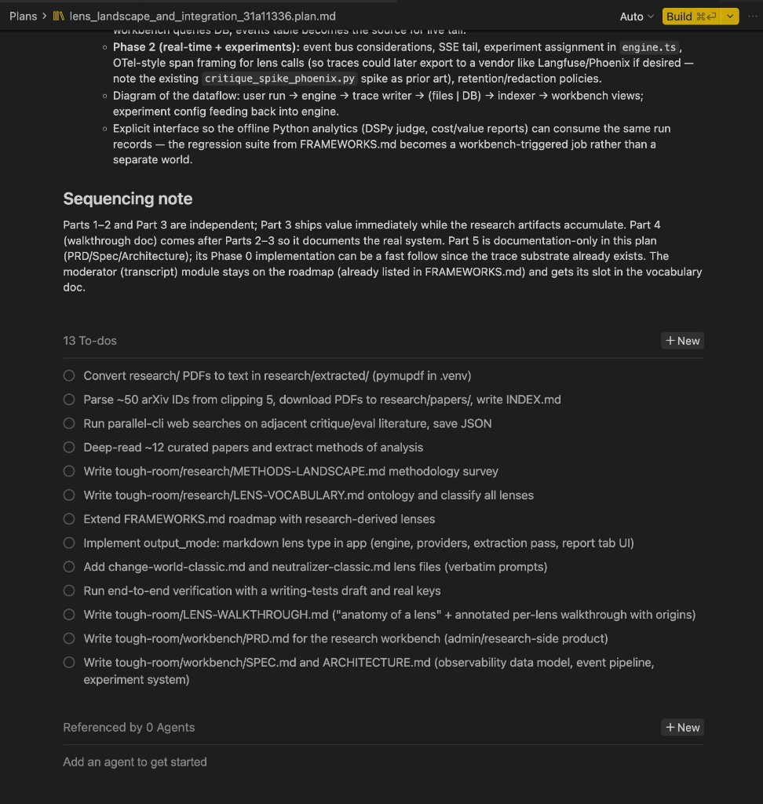

# Cursor plans, hands on: from one Build button to a tiny team of agents

*A narrative walkthrough for people who have used Plan Mode once and are now staring at a big plan, wondering what happens when they press Build.*

**Time:** ~45 minutes reading + one practice plan
**Prerequisites:** Cursor Pro (or similar), a repo with `.cursor/plans/`
**Companion reference:** [cursor-plans-agents-guide.md](../cursor-plans-agents-guide.md)

---

## The hook

You have a plan with **13 todos** and **Auto** selected in the Build bar — now what?

Do you just press Build and hope? Pin Opus "to be safe" and watch your API allowance evaporate? Babysit each todo by hand in chat?

There's a better answer hiding in the plan editor: **referenced agents** and **per-todo assignment**. This post walks through it the way I learned it — including the mistakes — so you build muscle memory instead of memorizing a spec. When you want the precise, citable version, that's the [reference guide](../cursor-plans-agents-guide.md).

---

## Act 1 — Make the plan real

Start where every plan starts:

1. Hit `Shift+Tab` in the agent input to enter [Plan Mode](https://cursor.com/docs/agent/plan-mode).
2. Answer the clarifying questions honestly — vague answers produce vague todos.
3. When the draft plan appears, **edit the todos**. Merge duplicates, split anything that says "and", delete the ones you'd never actually do.
4. **Save to workspace.** This moves the plan from `~/.cursor/plans/` into `<project>/.cursor/plans/`, where it's git-backed ([cursor-home-and-plans.md](../cursor-home-and-plans.md)).

Open the saved `.plan.md` and notice the three regions of the plan editor:

- **Top:** model picker + **Build** (`Cmd+Enter`)
- **Middle:** todos with status chips and assignment controls
- **Side:** **Referenced by N Agents** with a **+ New** button



My first mistake was treating that Agents panel as decoration. It's the whole point.

---

## Act 2 — Don't press Build yet

Here's why a single Auto Build on a mixed plan wastes money or quality (pick one).

Cursor has **two usage pools** ([Models & Pricing](https://cursor.com/docs/models-and-pricing)):

1. **Auto + Composer** — cheap, generous included usage.
2. **API pool** — every pinned Sonnet, Codex, or Fable 5 token bills at provider rates against your monthly included API allowance (Pro $20, Pro+ $70, Ultra $400).

A 13-todo plan is never homogeneous. It has mkdir-and-cross-link todos that Auto handles fine, and it has one or two interpretive todos where a cheap model produces mush. One Build click with one model means either:

- **Auto everywhere** — the mechanical todos are fine, the synthesis todo is mediocre, and you redo it (paying twice), or
- **Opus/Fable everywhere** — beautiful mkdir commands at $25–50 per million output tokens.

The fix is not "never use good models." It is: **route cheap work to Auto, pin expensive models only where judgment matters**, and **measure after each wave** on the [usage dashboard](https://cursor.com/dashboard?tab=usage).

Before spending anything, annotate your plan with a budget (convention from the [reference guide §6](../cursor-plans-agents-guide.md#6-plan-file-cost-annotations)):

```yaml
est_cost_usd:
  low: 0.5
  typical: 1.2
  high: 2.5
pool: auto
```

Quick math for any pinned todo:

```
cost ≈ (input_M × rate_in) + (output_M × rate_out)
```

Example: 100k in + 30k out on Sonnet ($3 / $15 per M) ≈ $0.30 + $0.45 = **$0.75**. Or run:

```bash
python3 scripts/estimate-plan-cost.py ~/.cursor/plans/my-plan.plan.md
```

Set a **ceiling** (e.g. `$15 API this session`). If your Balanced estimate exceeds it, move more todos to Auto.

---

## Act 3 — Hire a tiny team

Click **+ New** in the Agents panel. Cursor creates a **referenced agent** — a sub-composer bound to your plan — with **its own model picker**. That picker is the entire mechanism for mixing economical and premium models in one plan.

Pick models by task type, not vibes:

| Task type | Model tier | Pool | Why |
|-----------|-----------|------|-----|
| Scripts, downloads, mkdir, cross-links | Auto | Auto + Composer | Mistakes are cheap and obvious |
| Docs from a clear outline | Composer 2.5 | Auto + Composer | Fast, included usage |
| Specs, structured synthesis | Sonnet 4.6 | API | Needs coherence across files |
| Multi-file code features | GPT-5.3 Codex | API | Reliable code, worth the rate |
| One interpretive/narrative todo | Fable 5 | API | ~2× Opus — use **once**, not in bulk |

**Good Fable todo:** "Write a narrative walkthrough explaining tradeoffs to a newcomer."
**Bad Fable todo:** "Download 50 PDFs and write INDEX.md."

For most plans, two or three agents are plenty:

| Agent name | Model | Role |
|------------|-------|------|
| `janitor` | Auto | Mechanical work |
| `writer` | Composer 2.5 or Sonnet | Docs and synthesis |
| `coder` (optional) | GPT-5.3 Codex | Real implementation todos |

The counter updates to **Referenced by N Agents**. Leave **Auto** on the plan-level Build bar — pinned models belong on agents, never on the whole plan.

---

## Act 4 — Assign work

Each todo has an **assignment chip** (`Assigned to N agent(s)`). Click it and pick an agent.

Walk through one of each kind:

**A research todo → the janitor.** "Harvest 20 papers into `papers/` and write INDEX.md" is fetch-loop-write. Assign it to `janitor` (Auto). If it botches a filename, you'll see it instantly and it cost pennies.

**An implementation todo → the writer.** "Synthesize the methods landscape into a comparison doc" requires holding many sources in mind and making judgment calls. Assign it to `writer` with a pinned model. This is exactly the todo where Auto's opaque routing might hand you a fast-tier model and you'd only notice after reading three pages of filler.

You can also multi-select todos and use **build selected todos in a new agent** — Cursor spawns a fresh agent that receives just that subset plus the plan context. Handy when a wave doesn't map onto an existing agent.

One caveat to know now rather than discover later: **assignments and agent models are not saved in the `.plan.md` YAML**. They live in Cursor's UI registry. If you reinstall, they're gone — the todos survive in git, the routing doesn't. If you care, annotate `agent:` and `model:` per todo in the YAML as a convention (Cursor doesn't read it, but future-you does).

---

## Act 5 — Build in waves

Do not Build all the todos at once, even with agents assigned. Build a **wave**, check the result and the spend, then start the next wave.

### Worked mini-example: 3 todos, 2 agents

Try this in a scratch repo before touching anything real:

```yaml
todos:
  - id: scaffold
    content: Create docs/blog/ and a one-line README stub
    status: pending
  - id: draft
    content: Write 300 words on why Plan Mode beats ad-hoc chat for multi-step work
    status: pending
  - id: link
    content: Add one cross-link from README to the new doc
    status: pending
```

| Todo | Agent | Model | Why |
|------|-------|-------|-----|
| `scaffold` | janitor | Auto | Mechanical |
| `draft` | writer | Fable 5 | Narrative quality |
| `link` | janitor | Auto | One-line edit |

Build order: `scaffold` → `draft` → `link` → dashboard check. **Expected API spend:** ~$1–3, almost all of it Fable on `draft`. The whole drill takes ten minutes and teaches you the chip-click-build-check rhythm.

### Scaling up: the 13-todo lens plan

Same pattern, more waves. Here's how a real 13-todo research-and-build plan routes:

| Wave | Todos | Agent model |
|------|-------|-------------|
| 1. Corpus (parallel) | `pdf-extract`, `paper-harvest`, `lit-search` | Auto |
| 2. Scholar | `deep-read`, `methods-landscape`, `lens-vocabulary` | Fable 5 (fresh session per todo) |
| 3. Catalog | `frameworks-extend` | Composer 2.5 |
| 4. Builder | `report-mode` | GPT-5.3 Codex |
| 4. Builder | `classic-lenses` | Auto |
| 5. Verify | `verify-e2e` | Auto → Codex only if stuck |
| 6. Docs | `lens-walkthrough` | Fable 5 |
| 6. Docs | `workbench-prd`, `workbench-spec` | Composer 2.5 + Sonnet |

Wave 1 can run as **parallel agents** because the todos touch disjoint files. Waves 2+ run sequentially — mark todos complete between waves so each agent sees accurate plan state. After every wave: [usage dashboard](https://cursor.com/dashboard?tab=usage), compare against your `## Cost budget` table.

Full cost playbook with Lean/Balanced/Premium estimates: [reference guide Appendix B](../cursor-plans-agents-guide.md#appendix-b-lens-plan-13-todos--cost-playbook).

---

## Act 6 — When you're stuck

| Symptom | Likely cause | Fix |
|---------|--------------|-----|
| Agent says it does not see the plan | Build launched from chat, not the plan editor | Open the `.plan.md` tab → **Build** from there ([forum](https://forum.cursor.com/t/what-happens-when-plan-file-is-saved/135261)) |
| Wrong quality or cost | Whole plan on one pinned model | Add referenced agents; assign cheap todos to Auto |
| Todos not updating | Work running in a different agent/session than the plan | Run from the assigned agent or the plan's Build bar |
| Assignments gone after reinstall | Agents live in UI registry, not YAML | Re-create agents; annotate `model`/`agent` in plan YAML for git backup |
| One Build does not spawn a fleet | Product limitation today | Build selected todos into new agents manually ([forum](https://forum.cursor.com/t/telling-the-plan-agent-to-use-multi-agents/151771)) |

### Measure after each wave

Open [cursor.com/dashboard?tab=usage](https://cursor.com/dashboard?tab=usage) and compare actual spend to your budget table.

Teams admins can do it programmatically:

```bash
export CURSOR_ADMIN_API_KEY=...
scripts/fetch-cursor-usage-events.sh \
  --start 2026-06-10T00:00:00Z \
  --end 2026-06-10T23:59:59Z \
  --email you@example.com
```

Sum `chargedCents` and group by `model` to verify routing. Details: [reference guide §7](../cursor-plans-agents-guide.md#7-measure-after-execution).

Third-party helpers: [cursor-cost-calculator.com](https://cursor-cost-calculator.com/) for quick what-ifs; [kingdomseed/cursor-calculator](../upstream/kingdomseed__cursor-calculator/) for CSV import.

---

## Cheat sheet

| I want to… | Do this |
|------------|---------|
| Cheap bulk work | Auto agent + Auto on the Build bar |
| Reliable code | GPT-5.3 Codex agent, API pool |
| Great prose (once) | Fable 5 on **one** todo |
| Mix models | Referenced agents + per-todo assignment |
| Estimate before Build | Annotate plan + `estimate-plan-cost.py` |
| Verify after Build | Usage dashboard or Teams API |

---

## Closing — where this is heading

When you need the exact behavior of any UI element described above, the [reference guide](../cursor-plans-agents-guide.md) is the lookup table; this post is the rhythm.

Cursor is clearly moving toward **manager/worker plan execution**: referenced agents, per-todo assignment, and build-selected-todos are real in the app even where public docs lag. What's missing is the last mile — a single Build that dispatches assigned todos to their agents and runs the whole plan unattended. Until that ships, you are the manager: you design the waves, pick the models, click the chips. The good news is that the manual version teaches you exactly the judgment the automated version will eventually ask you to encode.

**Read next:** [reference guide](../cursor-plans-agents-guide.md) · [MULTIROOT-cursor-lifecycle.md §3](../MULTIROOT-cursor-lifecycle.md) (plan locations) · [CURSOR3-worktrees.md](../CURSOR3-worktrees.md) (parallel agents via worktrees)

*Last updated: 2026-06-11. Validate UI labels on your Cursor version.*
