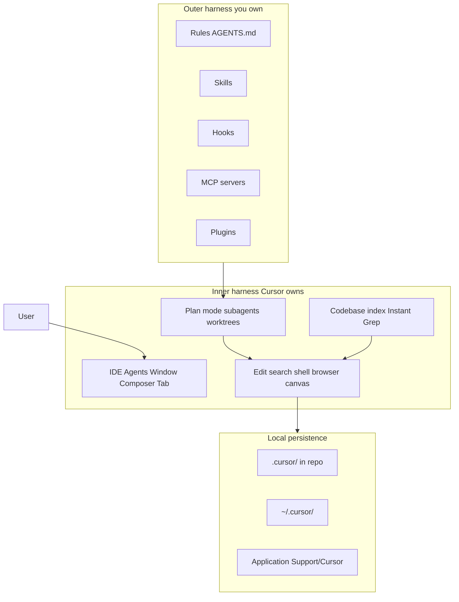

# Cursor architecture (top-down)

**Version pin:** [cursor-internals-VERSION.md](cursor-internals-VERSION.md) (3.13.25 / Nightly).  
**Siblings:** [inventory](cursor-internals-inventory.md) · [storage map](cursor-storage-map.md) · [validation](cursor-validation-matrix.md) · [canvases](cursor-canvases.md) · [settings guide](cursor-settings-guide.md) · [sources](cursor-internals-sources.md) · [tools SuperPRD](cursor-tools-superprd.md)

## Mental model

Official framing: an agent is **Instructions + Tools + Model** ([Cursor Agent overview](https://cursor.com/docs/agent/overview)).

### Layers

1. **Interface** — Editor, Agents Window, Chat/Composer, Tab, CLI, Cloud Agents entry points.
2. **Customization (outer harness)** — Rules, Skills, Subagents, Hooks, MCP, Plugins ([Customize docs](https://cursor.com/docs)).
3. **Orchestration** — Plan Mode, mode transitions (Agent/Plan/Debug), subagents/Task tool, queue messages, worktrees / best-of-n.
4. **Tools** — filesystem, shell, browser, web search/fetch, canvas, image gen ([Agent tools](https://cursor.com/docs/agent/tools)).
5. **Indexing / context** — codebase index, Instant Grep, Docs crawling, `@` mentions.
6. **Persistence** — see [storage map](cursor-storage-map.md): mix of git-friendly project files and orphaned home/App Support stores.

### Inner vs outer harness

Community framing (agent harness literature): the **inner harness** is vendor-owned (loop, sandbox, tool runtime); the **outer harness** is what you configure (rules, skills, MCP, hooks). Cursor documents the outer pieces extensively; local SQLite/chat layout is mostly community-discovered ([storage map](cursor-storage-map.md)).

## What is version-controlled by default

| Usually in git | Outside project git by default |
|----------------|--------------------------------|
| `.cursor/rules`, `.cursor/skills`, `.cursor/hooks.json`, `.cursor/mcp.json` | `~/.cursor/plans` (unless Save to workspace) |
| Workspace-saved `.cursor/plans` | `~/.cursor/projects/*/canvases` |
| Project `AGENTS.md` | `workspaceStorage` / `globalStorage` `state.vscdb` |
| | `~/.cursor/chats`, `agent-transcripts` |

## Related product docs in this repo

- [cursor-home-and-plans.md](cursor-home-and-plans.md) — plans locations + catalog script
- [MULTIROOT-cursor-lifecycle.md](MULTIROOT-cursor-lifecycle.md) — workspace lifecycle
- [keybindings-guide.md](keybindings-guide.md)
- [agents-window-hygiene.md](agents-window-hygiene.md)
- [SKILLS-MANAGEMENT.md](SKILLS-MANAGEMENT.md)
