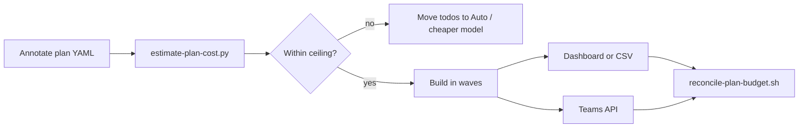

# Cursor cost tooling: estimate, measure, reconcile

Companion to [cursor-plans-agents-guide.md](cursor-plans-agents-guide.md) (plan execution) and [cursor-pricing-snapshot.md](cursor-pricing-snapshot.md) (rate card). For **Cloud Agents** API pricing + spend limits vs local chats, see [cursor-cloud-agents-vs-local.md](cursor-cloud-agents-vs-local.md).

Three phases:

| Phase | Goal | Tools in this repo |
|-------|------|-------------------|
| **Before Build** | Budget todos and pick models | `estimate-plan-cost.py`, kingdomseed calculator, pricing snapshot |
| **During Build** | Watch burn | Dashboard, optional IDE extensions |
| **After waves** | Reconcile estimate vs actual | Dashboard CSV, Teams API, CSV analyzers |

Research JSON (local, not committed by default): `cursor-cost-calculator-tools-research.json`, `cursor-cost-tools-github-research.json`, `cursor-usage-dashboard-api-research.json`, `cursor-individual-usage-api-research.json`.

---

## Before Build (estimation)

### Our scripts

| Script | Purpose |
|--------|---------|
| [scripts/estimate-plan-cost.py](../scripts/estimate-plan-cost.py) | Sum `est_cost_usd` from annotated `.plan.md`; `--compute` fills from model + tokens |
| [scripts/sync-cursor-pricing-snapshot.sh](../scripts/sync-cursor-pricing-snapshot.sh) | Refresh [data/cursor-plan-rates.json](../data/cursor-plan-rates.json) from upstream catalog |
| [scripts/reconcile-plan-budget.sh](../scripts/reconcile-plan-budget.sh) | Print estimate + optional Teams usage + delta template |

**Annotate plans** using [docs/templates/plan-cost-annotation.example.yaml](templates/plan-cost-annotation.example.yaml).

### kingdomseed/cursor-calculator (vendored)

**Path:** [upstream/kingdomseed__cursor-calculator/](../upstream/kingdomseed__cursor-calculator/)  
**Live:** [cursor-cost-calculator.com](https://cursor-cost-calculator.com/)  
**Source:** same repo as the website ([forum showcase](https://forum.cursor.com/t/simple-price-calculator-to-help-me-understand-my-usage/154793))

Best for:

- "I have $60/month — what plan fits?"
- Weighted model mix (60% Sonnet / 40% Opus)
- **CSV replay** from dashboard export with cache-aware math

**Run locally:**

```bash
scripts/run-cursor-calculator-local.sh
# open http://localhost:5173
```

Requires Node.js. Inside upstream: `npm install && npm run dev`.

### Web (no install)

[cursor-cost-calculator.com](https://cursor-cost-calculator.com/) — same math as kingdomseed; good for quick what-if before annotating a plan.

---

## During Build (monitoring)

### Official

| Resource | URL |
|----------|-----|
| Usage dashboard | [cursor.com/dashboard?tab=usage](https://cursor.com/dashboard?tab=usage) |
| Enable status bar usage | Cursor Settings (see [forum](https://forum.cursor.com/t/where-can-i-find-usage-limits/127834)) |

### IDE extensions (third-party — may break when billing changes)

| Extension | Install | Status |
|-----------|---------|--------|
| [Dwtexe/cursor-stats](https://github.com/Dwtexe/cursor-stats) | Open VSX / VSIX from `builds/` | **Archived Mar 2026** — historical reference |
| [Tendo33/cursor-usage-tracker](https://github.com/Tendo33/cursor-usage-tracker) | Open VSX search `cursor-usage-tracker` | Status bar quota |
| [Ittipong/cursor-price-tracking](https://github.com/Ittipong/cursor-price-tracking) | Open VSX | Per-model/session breakdown |
| [g-guerzoni/cli-cursor-usage-tracker](https://github.com/g-guerzoni/cli-cursor-usage-tracker) | CLI | Premium request % and $ limit |

Cursor uses [Open VSX](https://cursor.com/docs/configuration/extensions), not the full VS Code Marketplace — search in-app (`Cmd+Shift+X`).

**Not for Cursor:** [Evaneos/ccusage-cursor-extension](https://github.com/Evaneos/ccusage-cursor-extension) wraps Claude Code `ccusage` — wrong data source.

---

## After execution (measurement)

### Export CSV from dashboard

1. [Usage tab](https://cursor.com/dashboard?tab=usage)
2. Pick date range → **Export CSV**
3. Requires usage data from **Aug 2025+** (token columns) per [sethstrz/cursor-costs](https://github.com/sethstrz/cursor-costs)

### Our wrapper

```bash
scripts/cursor-cost-csv-analyze.sh ~/Downloads/cursor-usage.csv
```

Runs vendored analyzers when available (see [upstream/README.md](../upstream/README.md)).

### Vendored CSV tools

| Repo | Path | Strength |
|------|------|----------|
| [sethstrz/cursor-costs](../upstream/sethstrz__cursor-costs/) | `cursor_cost.py` | Zero deps; adds `API_COST` column |
| [dalssoft/cursor_cost_explorer](../upstream/dalssoft__cursor_cost_explorer/) | `node src/cli/index.js` | Privacy-first CLI + web UI; optimization hints |
| kingdomseed calculator | CSV import in web UI | Plan recommendation + replay |

**sethstrz (quick total):**

```bash
python3 upstream/sethstrz__cursor-costs/cursor_cost.py ~/Downloads/cursor-usage.csv
```

**dalssoft (richer report, Node 21+):**

```bash
cd upstream/dalssoft__cursor_cost_explorer && npm install
node src/cli/index.js analyze ~/Downloads/cursor-usage.csv
```

### Teams Admin API (programmatic)

```bash
export CURSOR_ADMIN_API_KEY=...   # team admin key from cursor.com/settings
scripts/fetch-cursor-usage-events.sh \
  --start 2026-06-10T00:00:00Z \
  --end 2026-06-10T23:59:59Z \
  --email you@example.com
```

Docs: [Admin API](https://cursor.com/docs/account/teams/admin-api). Sums `chargedCents` per model.

**Full reconcile workflow:**

```bash
scripts/reconcile-plan-budget.sh \
  --plan ~/.cursor/plans/my.plan.md \
  --start 2026-06-10T00:00:00Z \
  --end 2026-06-10T23:59:59Z
```

### Individual Pro limitation

No official personal usage API found ([cursor-individual-usage-api-research.json](../cursor-individual-usage-api-research.json)). Solo users: dashboard + CSV export + kingdomseed replay.

---

## Upstream index

See [upstream/README.md](../upstream/README.md) for clone URLs, update commands, and evaluation notes.

---

## Suggested workflow



1. Annotate todos → run `estimate-plan-cost.py --compute`
2. Optional: kingdomseed calculator for plan-tier / CSV replay
3. Build wave-by-wave; check dashboard after each wave
4. Export CSV or call Teams API → compare to `## Cost budget` table in plan body

---

## Enterprise / npm

| Package | Notes |
|---------|-------|
| [cursor-usage-tracker on npm](https://www.npmjs.com/package/cursor-usage-tracker) | Team spend monitoring + Slack alerts — Enterprise-oriented |

---

## Related docs

- [cursor-plans-agents-guide.md](cursor-plans-agents-guide.md) — agents, assignment, cost-aware execution
- [blog/cursor-plans-hands-on.md](blog/cursor-plans-hands-on.md) — newbie walkthrough
- [cursor-pricing-snapshot.md](cursor-pricing-snapshot.md) — slim rate card
