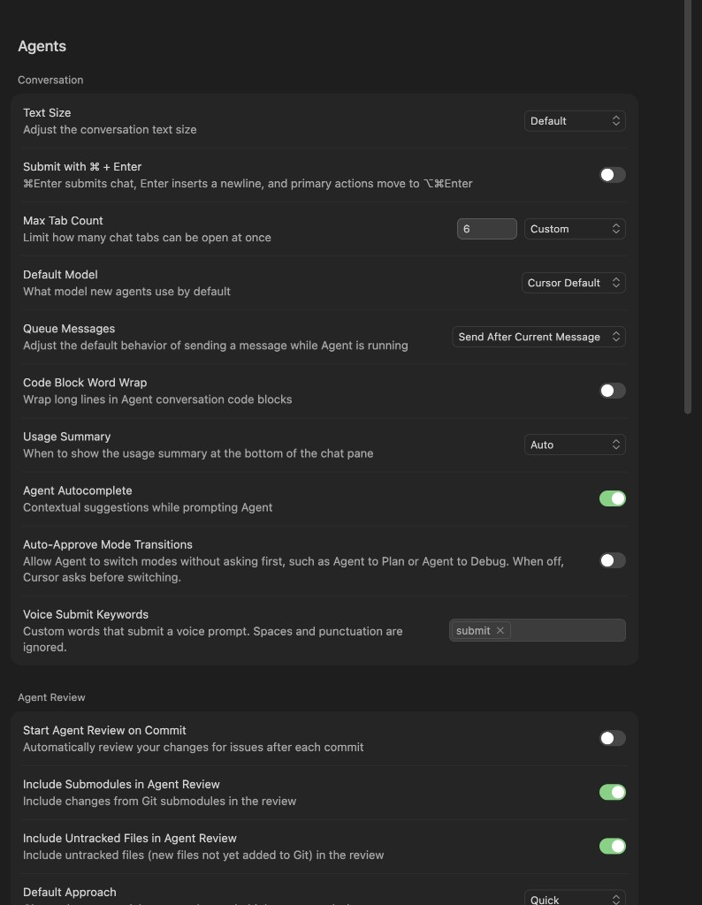
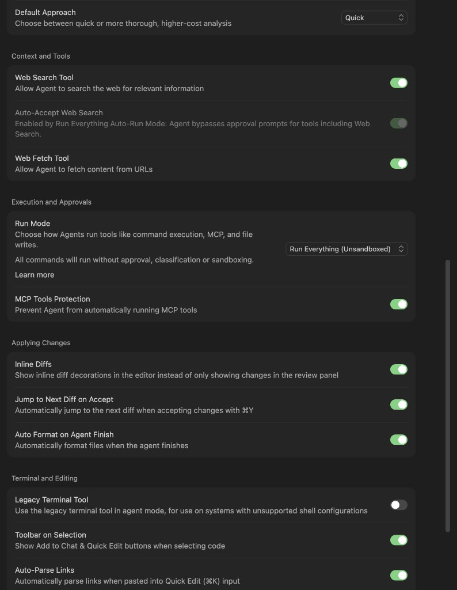
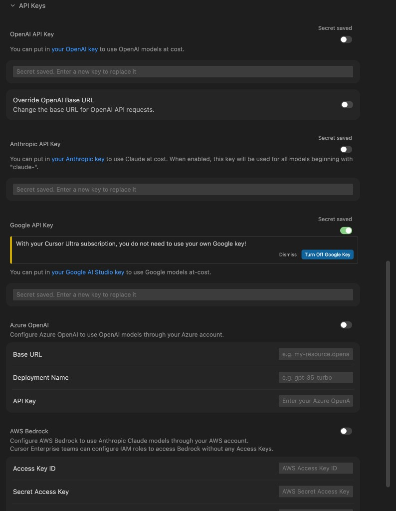
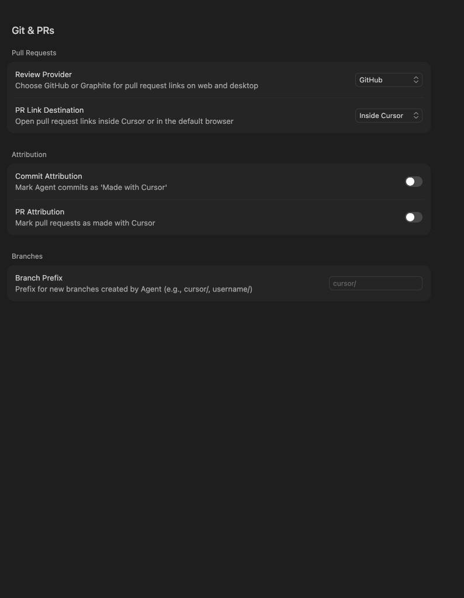
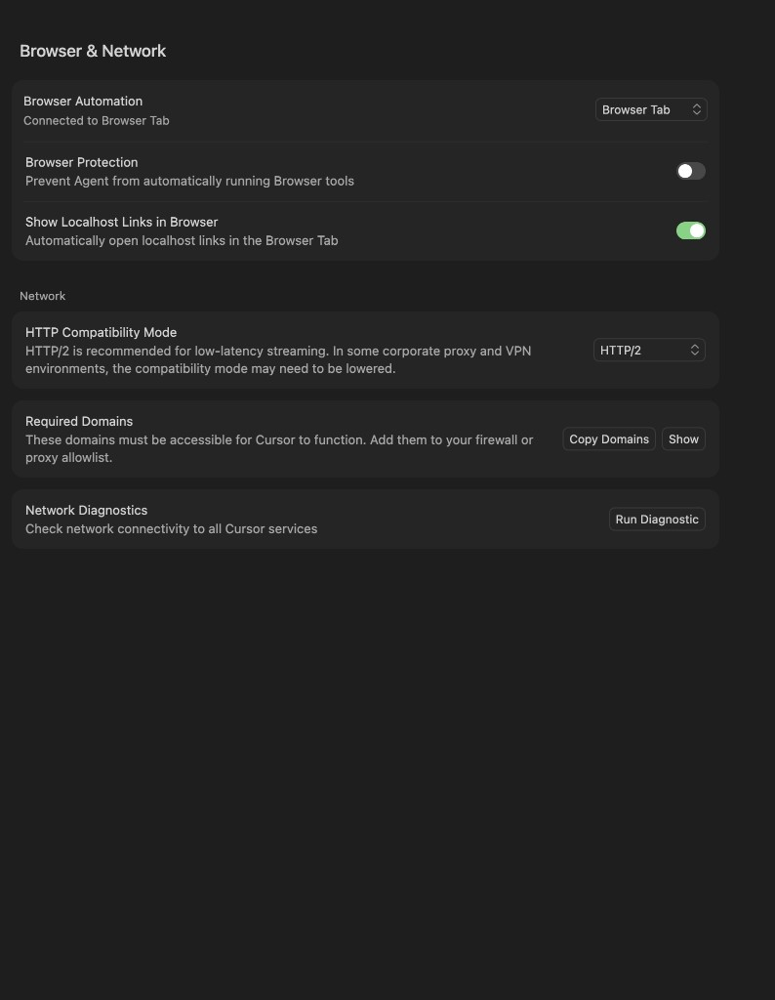
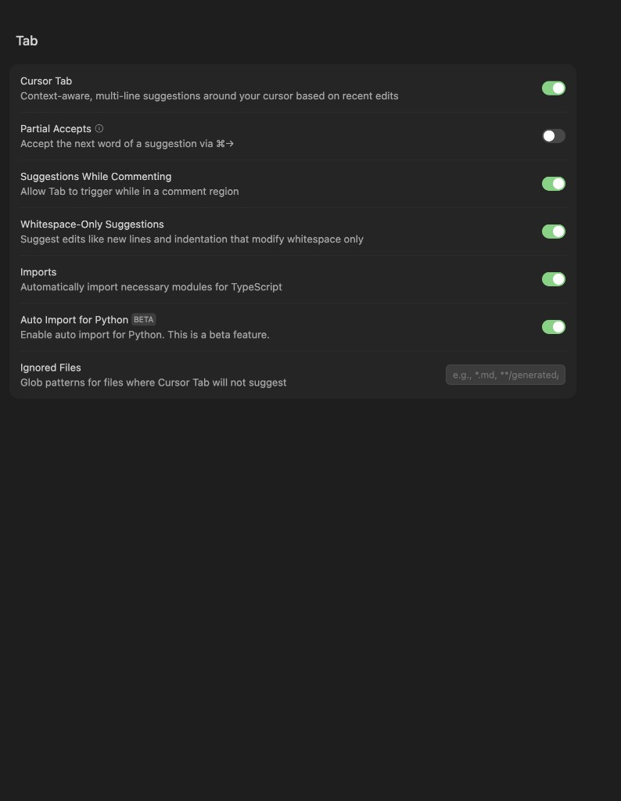
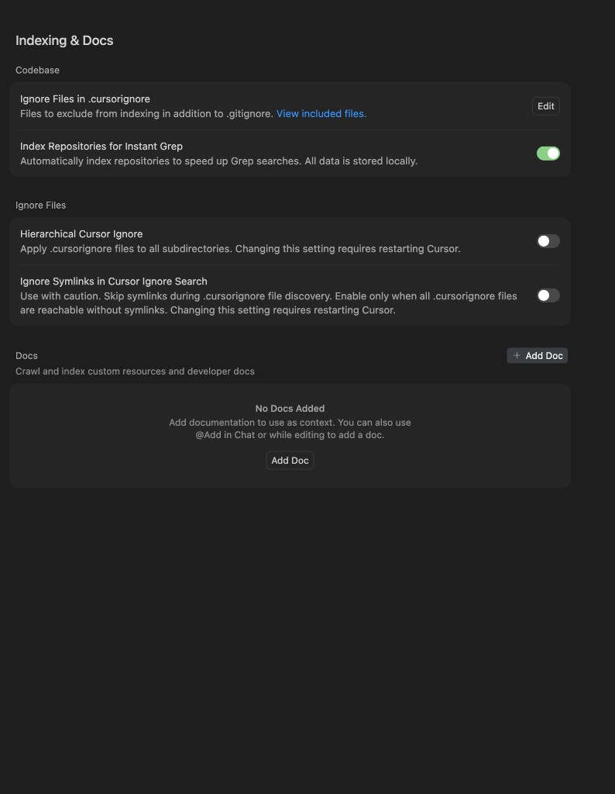

# Cursor settings guide (annotated)

**Version pin:** [cursor-internals-VERSION.md](cursor-internals-VERSION.md) (3.13.25 / Nightly).  
**Screenshots:** [assets/settings-01-general.png](assets/settings-01-general.png) … [settings-20-beta-nightly.png](assets/settings-20-beta-nightly.png).  
**Live settings SoT (symlink):** [../settings.json](../settings.json) · inventory: [../CONFIG_INVENTORY.md](../CONFIG_INVENTORY.md).

Defaults below are Cursor product defaults where known; many Agents UI toggles live in reactive/app storage rather than `settings.json` (mark **UI-only**).

## How to read the tables

| Column | Meaning |
|--------|---------|
| Default | Typical Cursor default |
| Yours | From Jul 2026 screenshots / settings.json |
| Power-user | Recommendation for multi-machine harness / ChatStory corpus work |
| Risk | Why not blindly flip |

---

## Agents — Conversation

| Setting | Default | Yours | Power-user | Risk |
|---------|---------|-------|------------|------|
| Text Size | Default | Default | Default | — |
| Submit with ⌘Enter | Off | Off | Off (Enter = newline for long prompts) | Muscle memory |
| Max Tab Count | product default | **Custom 6** | 6–8 if many parallel agents | Too low closes tabs |
| Default Model | Cursor Default | Cursor Default | Keep Default unless pinning | Cost |
| Queue Messages | Send After Current | Send After Current | Keep | — |
| Code Block Word Wrap | Off | Off | On if reading long logs in chat | Layout |
| Usage Summary | Auto | Auto | Auto | — |
| Agent Autocomplete | On | **On** | On | — |
| Auto-Approve Mode Transitions | Off | **Off** | **Off** (keep human gate) | Silent Plan/Debug switches |
| Voice Submit Keywords | (empty/product) | `submit` | Keep explicit keyword | Accidental submit |

## Agents — Agent Review

| Setting | Default | Yours | Power-user | Risk |
|---------|---------|-------|------------|------|
| Start Agent Review on Commit | Off | **Off** | Off unless you want every commit reviewed | Noise/cost |
| Include Submodules | Off? | **On** | On if you use submodules | Scope |
| Include Untracked | Off? | **On** | On for new-file reviews | Secrets in untracked |
| Default Approach | Quick | **Quick** | Quick daily; Thorough for releases | Cost |

## Composer / Context & Tools / Execution

| Setting | Default | Yours | Power-user | Risk |
|---------|---------|-------|------------|------|
| Web Search Tool | On | **On** | On | — |
| Auto-Accept Web Search | Off / mode-tied | **Off** | Off unless Run Mode already auto | Surprise fetches |
| Web Fetch Tool | On | **On** | On | SSRF/content |
| Run Mode | Ask / sandboxed | **Run Everything (Unsandboxed)** | Prefer **Auto-review** or sandboxed for untrusted repos; keep Unsandboxed only on trusted personal machines | **High** — full auto shell |
| MCP Tools Protection | On | **On** | **Keep On** even with Run Everything | Tension: shell free, MCP gated |
| Inline Diffs | On | On | On | — |
| Jump to Next Diff on Accept | On | On | On | — |
| Auto Format on Agent Finish | On | On | On if formatter trusted | Bad formatters |
| Legacy Terminal Tool | Off | Off | Off | — |
| Toolbar on Selection | On | On | On | — |
| Auto-Parse Links | On | On | On | — |
| Themed Diff Backgrounds | On | On | On | — |
| Terminal Hint | On? | Off | Off if noisy | — |
| Preview Box for Terminal ⌘K | On | **On** (`cursor.terminal.usePreviewBox`) | On | — |

**Power-user note:** Your combo (Run Everything + MCP Protection On) is a deliberate speed/safety split. Document it; don’t “fix” MCP Protection off to match Run Mode.

## API Keys

| Provider | Yours | Power-user |
|----------|-------|------------|
| OpenAI | Secret saved, toggle **Off** | Off if Ultra covers needs |
| Anthropic | Secret saved, toggle **Off** | Off if Ultra covers needs |
| Google | Secret saved, toggle **On** (Ultra banner suggests off) | **Turn Off** unless you need Google at-cost / non-Ultra routing |
| Azure / Bedrock | Off | Off unless enterprise |

Never commit key material; redact screenshots in public forks.

## Git & PRs

| Setting | Yours | Power-user |
|---------|-------|------------|
| Review Provider | GitHub | GitHub |
| PR Link Destination | Inside Cursor | Inside Cursor (or browser if you prefer) |
| Commit Attribution | **Off** | Off (your preference) |
| PR Attribution | **Off** | Off |
| Branch Prefix | `cursor/` | `cursor/` or `username/` |

## Plugins / Rules / Skills / MCP / Hooks

Screenshots: [11](assets/settings-11-plugins.png)–[16](assets/settings-16-hooks.png).

| Area | Yours | Power-user |
|------|-------|------------|
| Include Third-Party Configs | On | On if you trust plugin sources |
| MCP servers | Many enabled (Workspace, Zoom, Tana, …); context7 Disabled; cloudflare-observability needs auth | Prefer **toolboxes** + toggle script; disable unused |
| Hooks | 1Password `beforeShellExecution` validate-mounted-env-files | Keep security hooks; watch execution log |
| Rules / skills volume | Large (100+ skills, many commands) | Prefer project-scoped skills; archive unused |

## Browser & Network

| Setting | Yours | Power-user |
|---------|-------|------------|
| Browser Automation | Browser Tab | Browser Tab |
| Browser Protection | **Off** | On for untrusted sites; Off for local app testing |
| Show Localhost Links | **On** | On |
| HTTP Compatibility | HTTP/2 | HTTP/2 unless corporate proxy forces lower |

## Tab

| Setting | Yours | Power-user |
|---------|-------|------------|
| Cursor Tab | On | On |
| Partial Accepts | Off | On if you like ⌘→ word accept |
| Suggestions While Commenting | On | On |
| Whitespace-Only Suggestions | On | On |
| Imports / Python Auto Import | On | On |

## Indexing & Docs

| Setting | Yours | Power-user |
|---------|-------|------------|
| Instant Grep index | **On** | On |
| Hierarchical Cursor Ignore | Off | On for monorepos with nested ignores (restart) |
| Ignore Symlinks | Off | Off unless symlink hell |
| Docs | None added | Add only high-value external docs; prefer Context7/MCP |

## Beta

| Setting | Yours | Power-user |
|---------|-------|------------|
| Update Access | **Nightly** (auto-apply on quit) | Nightly OK for this corpus machine; keep a Stable install for critical delivery work |

## settings.json deltas (partial)

Present in [settings.json](../settings.json):

- `cursor.terminal.usePreviewBox`: true
- `cursor.composer.conversationDensity`: detailed
- `cursor.composer.shouldChimeAfterChatFinishes`: true
- `cursor.general.emailPrivacyEnabled`: true

Many Agents toggles from screenshots are **UI-only** (not mirrored here).

## Startup / Agents Window vs classic IDE

There is **no** `settings.json` key that makes workspace opens land in the classic IDE. CLI default: [cursor-classic-ide.md](cursor-classic-ide.md) (`just install-classic-cli`).

**UI-only (dock / app icon):** Cursor Settings (`Cmd+Shift+J`) → **General → Startup → Window Restoration** → **Last Used Windows**. Quit from an Editor window so restore does not loop on Agents Window. Palette **Open IDE** switches an already-open Agents session.

## Power-user checklist (summary)

1. Keep **Auto-Approve Mode Transitions Off**.
2. Keep **MCP Tools Protection On**; reconsider **Run Everything** on shared/untrusted repos.
3. Turn **Google BYOK Off** if Ultra covers Gemini (banner agrees).
4. Keep **Nightly** only where you accept silent updates.
5. Cap agent tabs (your **6** is good).
6. Prefer toolbox MCP over always-on global MCP sprawl.
7. Catalog plans/canvases with repo scripts; don’t rely on Settings for VCS.
